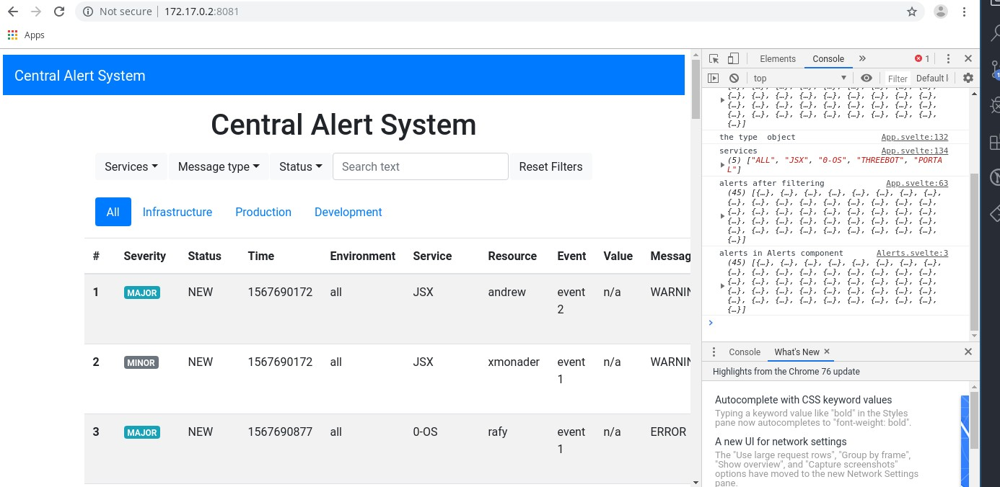

# Alerta

central monitoring system built using svelte and gedis actors



## Running 

- execute `kosmos -p 'j.threebot.package.alerta.start()'`
- `kosmos -p run_server.py`
- server will start at `172.17.0.2:8081`

## the package file

- create openresty server on a port
- create a location to server from
- `use_jumpscale_weblibs` to support gedis/extra jsx assets
- add actors

```python3
        server = j.servers.openresty.get("test")
        server.install(reset=False)
        server.configure()
        website = server.websites.get("alerta")
        website.ssl = False
        website.port = 8081
        locations = website.locations.get("alerta")

        website_location = locations.locations_static.new()
        website_location.name = "alerta"
        website_location.path_url = ""
        website_location.use_jumpscale_weblibs = True
        # import pdb; pdb.set_trace()
        fullpath = join(dirname(abspath(__file__)), "html/")
        print(fullpath)
        print(fullpath)
        website_location.path_location = fullpath
        # import pdb; pdb.set_trace()
        locations.configure()
        website.configure()
        self.gedis_server.actors_add(j.sal.fs.joinPaths(self.package_root, "actors"))
        server.start()
```


## actors

- `list_alerts` : list all alerts 
- `list_alerts_by_env`: get alerts by environment
- `new_alert`: create new alert in system
```python3
from Jumpscale import j


"""

JSX> anew.actors.alerta.list_alerts() 
... a very long list
JSX> anew.actors.alerta.new_alert(        severity="major", 
   2         status="new", 
   3         time=None, 
   4         environment="ALL", 
   5         service="JSX", 
   6         resource="xmonader", 
   7         event="event 1", 
   8         value="n/a", 
   9         messageType="error", 
  10         text="rafir text")                                                                                        
## actors.default.alerta.new_alert.16c54214bfcd2a5b61f789be085a1d14
res                 : True


"""


class alerta(j.baseclasses.threebot_actor):
    def _init(self, **kwargs):

        from random import choice

        alert_schema = """
        @url = jumpscale.alerta.alert

        severity="" (S)
        status="" (S)
        time="" (S)  
        environment = "" (S)
        service = "" (S)
        resource = "" (S)
        event = "" (S)
        value = "" (S)
        messageType = "" (S)
        text = "" (S)

        """

        self.alert_model = j.data.bcdb.system.model_get(schema=alert_schema)
        # self.alert_model.save()
        for i in range(10):
            alert = self.alert_model.new()
            alert.severity = choice(["critical", "major", "minor", "warning"])
            alert.status = choice(["closed", "new"])
            alert.time = j.data.time.epoch
            alert.environment = choice(["production", "staging", "testing", "infrastructure", "all"])
            alert.service = choice(["jsx", "0-os", "portal", "threebot"])
            alert.resource = choice(["xmonader", "rafy", "andrew"])
            alert.event = choice(["event 1", "event 2"])
            alert.value = "n/a"
            alert.messageType = choice(["error", "information", "warning"])
            alert.text = choice(["text 1 errr", "text 2 errr", "text 3 err"])

            alert.save()

    def list_alerts(self):
        alerts = j.data.serializers.json.dumps(
            {"alerts": [alert._ddict for alert in self.alert_model.find()]}
        )
        return alerts

    def list_alerts_by_env(self, env_name='all',schema_out=None, user_session=None):
        """
        ```in
        env_name = (S)
        ```

        """
        alerts = j.data.serializers.json.dumps(
            {"alerts": [alert._ddict for alert in self.alert_model.find() if alert.environment==env_name.lower()]}
        )
        
        print("ALERTS: ", alerts)
        return alerts

    def new_alert(
        self,
        severity="major",
        status="new",
        time=None,
        environment="all",
        service="JSX",
        resource="xmonader",
        event="event 1",
        value="n/a",
        messageType="error",
        text="error text",
        schema_out=None
    ):
        """
        ```in 
        severity="" (S)
        status="" (S)
        time="" (S)  
        environment = "" (S)
        service = "" (S)
        resource = "" (S)
        event = "" (S)
        value = "" (S)
        messageType = "" (S)
        text = "" (S)
        ```

        ```out
        res = (B)
        ```        

        """

        print(locals())
        alert = self.alert_model.new()
        alert.severity = severity
        alert.status = status
        alert.time = time or j.data.time.epoch
        alert.environment = environment
        alert.service = service
        alert.resource = resource
        alert.event = event
        alert.value = value
        alert.messageType = messageType
        alert.text = text

        alert.save()

        res = schema_out.new()
        res.res = True
        return res
```

## factory

```python3
from Jumpscale import j


class AlertaFactory(j.baseclasses.object, j.baseclasses.testtools):

    __jslocation__ = "j.threebot.package.alerta"

    def install(self):
        server = j.servers.threebot.default
        server.save()

        package = j.tools.threebot_packages.get("alerta", path=self._dirpath, threebot_server_name=server.name)
        package.prepare()
        package.save()
        self._log_info("Alerta loaded")

        return "OK"

    def start(self):
        self.install()
        server = j.servers.threebot.default
        server.start(web=True, ssl=False)

    def test(self, name=""):
        pass

```
