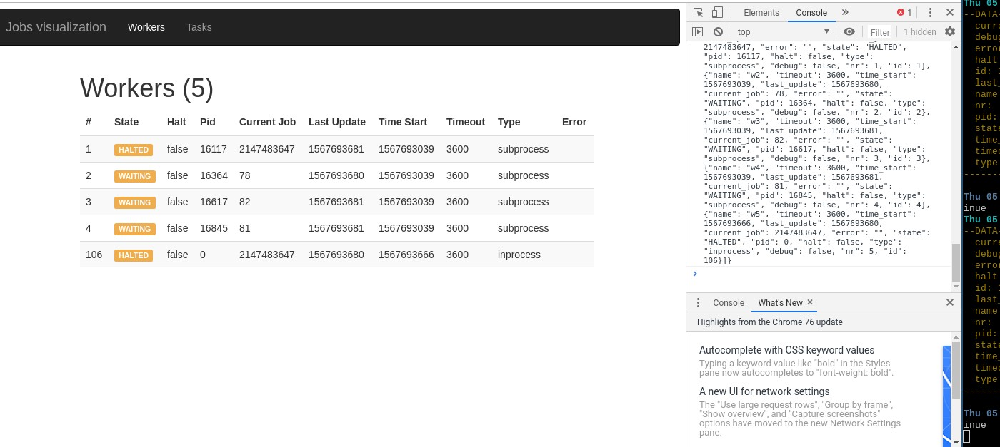
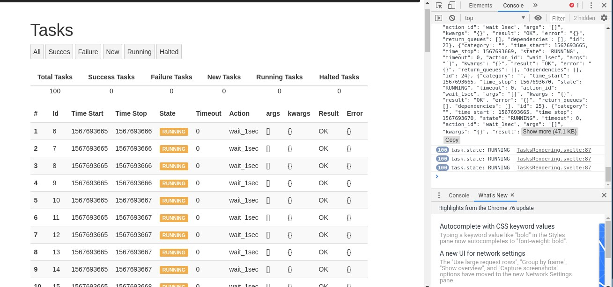

# MyJobs

Job visualizer for myjobs




## Running 

- execute `kosmos -p 'j.threebot.package.myjobs_dashboard.start()'`
- server will start at `172.17.0.2:8080`


## the package file

- create openresty server on a port
- create a location to server from
- `use_jumpscale_weblibs` to support gedis/extra jsx assets
- add actors

```python3
    def start(self):
        """
        called when the 3bot starts
        :return:
        """
        j.servers.myjobs.workers_tmux_start()

        server = j.servers.openresty.get("test")
        server.install(reset=False)
        server.configure()
        website = server.websites.get("myjobs")
        website.ssl = False
        website.port = 8080
        locations = website.locations.get("myjobs")

        website_location = locations.locations_static.new()
        website_location.name = "myjobs"
        website_location.path_url = ""
        website_location.use_jumpscale_weblibs = True
        fullpath = join(dirname(abspath(__file__)), "html/")
        website_location.path_location = fullpath
        locations.configure()
        website.configure()
        self.gedis_server.actors_add(j.sal.fs.joinPaths(self.package_root, "actors"))
        server.start()

```

## actors

- `list_workers`: list all the workers
- `list_tasks`: list all tasks

```python3
from Jumpscale import j


class myjobs(j.baseclasses.threebot_actor):
    def _init(self, **kwargs):
        self.job_model = j.servers.myjobs.model_job
        self.action_model = j.servers.myjobs.model_action
        self.worker_model = j.data.bcdb.myjobs.model_get(url="jumpscale.myjobs.worker")

    def list_workers(self):

        def transform_worker(worker_obj):
            states_dict = dict(zip(range(5), "NEW,ERROR,BUSY,WAITING,HALTED".split(",")))
            worker_types_dict = dict(zip(range(3), "tmux,subprocess,inprocess".split(",")))

            worker_dict = worker_obj._ddict
            worker_dict["state"] = states_dict[worker_dict["state"]]
            worker_dict["type"] = worker_types_dict[worker_dict["type"]]

            return worker_dict
        workers = j.data.serializers.json.dumps(
            {"workers": [transform_worker(worker) for worker in self.worker_model.find()]}
        )
        print("returning workers  ", workers)
        return workers
        
    def list_action(self):
        return []

    def list_jobs(self):
        def transform_job(job_obj):
            states_dict = dict(zip(range(5), "NEW,ERROR,OK,RUNNING,HALTED".split(",")))
            job_dict = job_obj._ddict
            job_dict["state"] = states_dict[job_dict["state"]]
            job_dict["args"] = str(job_dict["args"])
            job_dict["kwargs"] = str(job_dict["kwargs"])
            job_dict["result"] = str(job_dict["result"])
            job_dict["error"] = str(job_dict["error"])
            try:
                job_dict["action_id"] = self.action_model.get(
                    job_dict["action_id"]
                ).methodname
            except:
                pass
            return job_dict

        jobs = j.data.serializers.json.dumps(
            {"jobs": [transform_job(job) for job in self.job_model.find()]}
        )
        print("returning jobs  ", jobs)
        return jobs
        # return JOBS

```

## factory file

```python3
from Jumpscale import j


class MyJobsDashboardFactory(j.baseclasses.object, j.baseclasses.testtools):

    __jslocation__ = "j.threebot.package.myjobs_dashboard"

    def install(self):
        server = j.servers.threebot.default
        server.save()

        package = j.tools.threebot_packages.get(
            "myjobs_dashboard", path=self._dirpath, threebot_server_name=server.name
        )
        package.prepare()
        package.save()
        self._log_info("MyJobs dashboard loaded")

        return "OK"

    def start(self):
        self.install()
        server = j.servers.threebot.default
        server.start(web=True, ssl=False)

    def test(self, name=""):
        pass

```