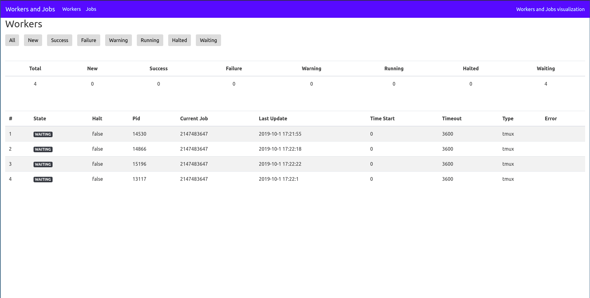
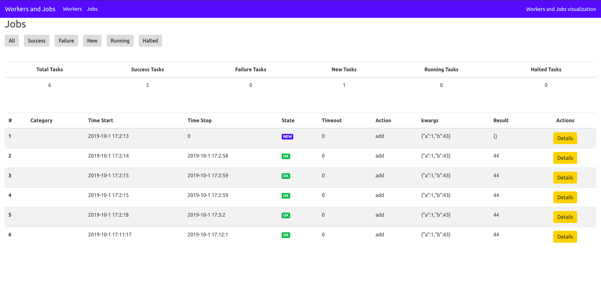

# MyJobs

Job visualizer for myjobs

## Running

- install frontend dependencies `cd jobvis && npm install`
- build frontend `./build_frontend.sh`
- execute `kosmos -p 'j.threebot.package.myjobs_dashboard.start()'`
- server will start at `172.17.0.2`

## Package file

- create openresty server on a port
- create location for sapper and gedis http to access added actors

See [package.py](package.py).

## Actors

See [actors](actors), for example, myjobs actor have the following methods:

- `list_workers`: list all the workers
- `list_tasks`: list all tasks

## Factory

The factory file will make it easier to run this package directly (it will get the package and start the default threebot server).

See [MyJobsDashboardFactory.py](MyJobsDashboardFactory.py).

