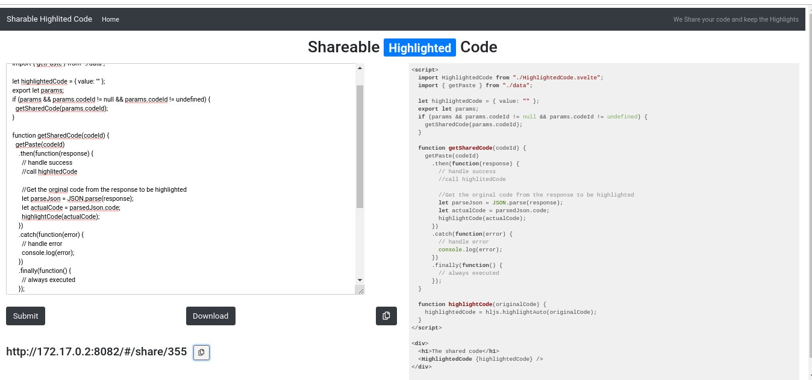
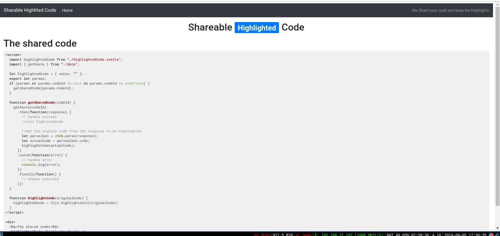

# Pastebin

code sharing system built using svelte and gedis actors





## Running 

- execute `kosmos -p 'j.threebot.package.pastebin.start()'`
- server will start at `172.17.0.2:8082`

## the package file

- create openresty server on a port
- create a location to server from
- `use_jumpscale_weblibs` to support gedis/extra jsx assets
- add actors

```python3

        server = j.servers.openresty.get("test")
        server.install(reset=False)
        server.configure()
        website = server.websites.get("pastebin")
        website.ssl = False
        website.port = 8082
        locations = website.locations.get("pastebin")

        website_location = locations.locations_static.new()
        website_location.name = "pastebin"
        website_location.path_url = ""
        website_location.use_jumpscale_weblibs = True
        # import pdb; pdb.set_trace()
        fullpath = join(dirname(abspath(__file__)), "html/")
        print(fullpath)
        print(fullpath)
        website_location.path_location = fullpath
        # import pdb; pdb.set_trace()
        locations.configure()
        website.configure()
        self.gedis_server.actors_add(j.sal.fs.joinPaths(self.package_root, "actors"))
        server.start()


```
- we are connecting to our endpoints (actors) using bottle server
```python
 ## START BOTTLE ACTORS ENDPOINT

        rack = j.servers.rack.get()
        # get gedis http server
        app = j.servers.gedishttp.get_app()

        # add gedis http server to the rack
        rack.bottle_server_add(name="gedishttp", port=9201, app=app)

        # create location `/actors` to on your website `8084` to forward
        # requests to `9201` where the bottle server is running
        proxy_location = locations.locations_proxy.new()
        proxy_location.name = "gedishttp"
        proxy_location.path_url = "/actors"
        proxy_location.ipaddr_dest = "0.0.0.0"
        proxy_location.port_dest = 9201
        proxy_location.scheme = "http"
        ## END BOTTLE ACTORS ENDPOINT
```


## actors

- `new_paste` : new_paste 
- `get_paste`: get paste

```python3
from Jumpscale import j


class pastebin(j.baseclasses.threebot_actor):
    def _init(self, **kwargs):

        from random import choice

        paste_schema = """
        @url = jumpscale.pastebin.paste
        code = "" (S)
        """

        self.paste_model = j.data.bcdb.system.model_get(schema=paste_schema)
        for i in range(10):
            paste = self.paste_model.new()
            paste.code = """print("hello")"""

    def get_paste(self, paste_id):
        paste = j.data.serializers.json.dumps(self.paste_model.get(paste_id)._ddict)
        return paste

    def new_paste(self, code):
        paste = self.paste_model.new()
        paste.code = code
        paste.save()
        res = j.data.serializers.json.dumps(paste._ddict)
        return res
```

## PastebinFactory


```
from Jumpscale import j


class PastebinDashboardFactory(j.baseclasses.object, j.baseclasses.testtools):

    __jslocation__ = "j.threebot.package.pastebin"

    def install(self):
        server = j.servers.threebot.default
        server.save()

        package = j.tools.threebot_packages.get("pastebin", path=self._dirpath, threebot_server_name=server.name)
        package.prepare()
        package.save()
        self._log_info("pastebin loaded")

        return "OK"

    def start(self):
        self.install()
        server = j.servers.threebot.default
        server.start(web=True, ssl=False)

    def test(self, name=""):
        pass

```
