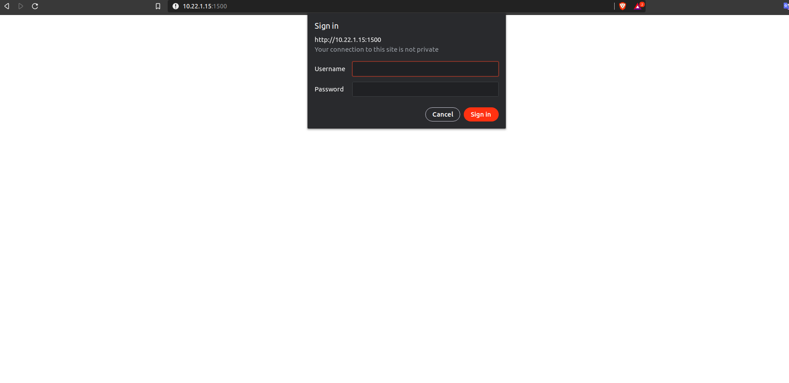

## Threebot reservation

#### This package is used to deploy a 3bot in a container on the grid using a chatflow:
You can both restore a previously backed up 3bot or deploy a new one using chatflow.
Your deployed 3bot container will have started from jsx flist.

* **URL**: {host}/tfgrid/threebot_provisioning/chat/threebot_reservation
* **Inputs**:
   - You can choose to deploy a new 3bot or restore my 3bot (if you already have one that has been backed up and you want to restore it)
   - **ssh key** : add your public ssh key `~/.ssh/id_rsa.pub` that will allow you ssh access to your 3bot container
   - **corex user**: setting username which will allow you secure access to the 3bot from your web browser using coreX
   - **corex password**: setting password which will allow you secure access to the 3bot from your web browser using coreX
   - **IP version**: choose whether you prefer to access your 3bot using IPv4 or IPv6. If unsure, choose IPv4
   - **IP range**: Configure network to manually by choosing an IP range to use or the deployer can choose for you and generate an IP range automatically
   - **Network name**: a name for the network to deploy on,  if left empty it will be a generated name
   - **IP Address**: choose the ip address for your 3bot machine.
   - **Backup password**: in case you want your 3bot to be automatically backed up (in s3) a password should be provided. You will later use it to restore your 3bot.
* **User setup** 
    - register user threebot on explorer ```kosmos "j.tools.threebot.init_my_threebot(name=3bot_NAME,email=EMAIL)"``` Note: name of 3bot is (your 3bot name).3bot , email is your 3bot email
    - Install [wireguard](https://www.wireguard.com/install/)


After the deployment of the threebot is complete,  a url will be returned that can be used to access it after up your wireguard configuration.

## Screenshots:
-  When accessing the link provided and directed to the 3bot deployed, you will be directed to corex of the machine shown in the following:
    * need your username and password of corex to access the web browser

    * The process of the 3bot on your 3bot are shown in the following:

    * The wikis of the packages installed on your 3bot are shown in the following:

