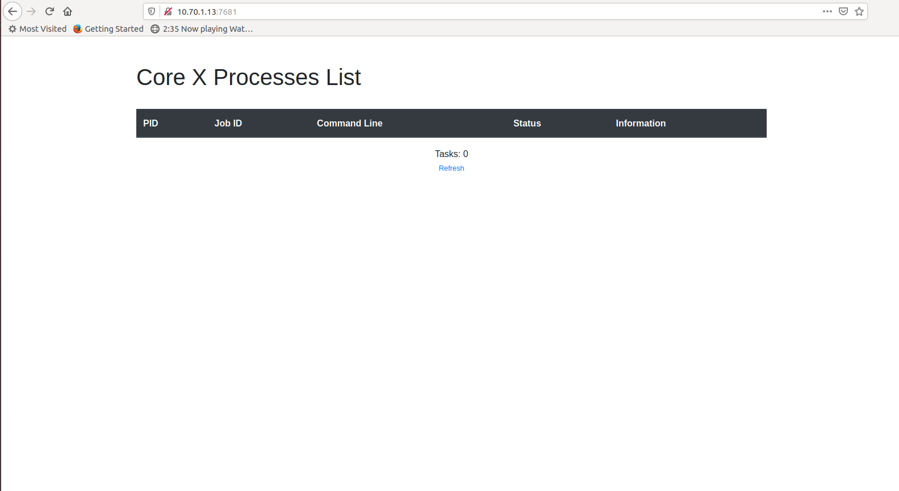

## your flist deploy

#### This package is used to deploy any flist in a container on the grid using a chatflow:
Your deployed a container will have started from container flist.

* **URL**: {host}/tfgrid_solutions/any_flist/chat/your_flist
* **Inputs**:
   - **container name** a name of your conatiner to help you to get it again with reservation id.
   - **Flist link** : the link of your flist to be deployed. For example: https://hub.grid.tf/usr/example.flist
   - **environment variables**: set environment variables on your deployed container, enter comma-separated variable=value For example: var1=value1, var2=value2. Leave empty if not needed
   - **Expiration time**: a network expiration time (minutes=m ,hour=h, day=d, week=w, month=M)
   - **Inetractive**:  choose whether you prefer to access to your container through the web browser (coreX) or not.
   - **ssh key** : add your public ssh key `~/.ssh/id_rsa.pub`, if your flist supports using the ssh key from the env variables provided to allow future ssh access
   - **IP Address**: choose the ip address for your ubuntu machine.
* **User setup** 
    - register user threebot on explorer ```kosmos "j.tools.threebot.init_my_threebot(name=3bot_NAME,email=EMAIL)"``` Note: name of 3bot is (your 3bot name).3bot , email is your 3bot email
    - Install [wireguard](https://www.wireguard.com/install/)


After the deployment of the flist is complete, a url will be returned that can be used to access the container through web browser (corex) or by ssh if your flist support this after up your wireguard configuration.

## Screenshots:
 * chatflow steps:
 
 
 
 
 
 
 
 
 
 
- creating flist with https://hub.grid.tf/tf-bootable/ubuntu:18.04
