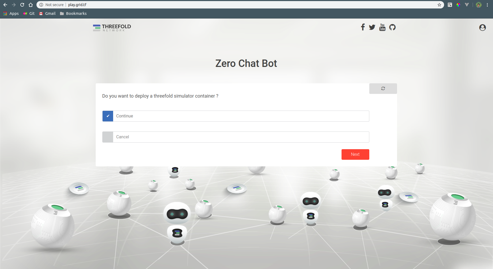
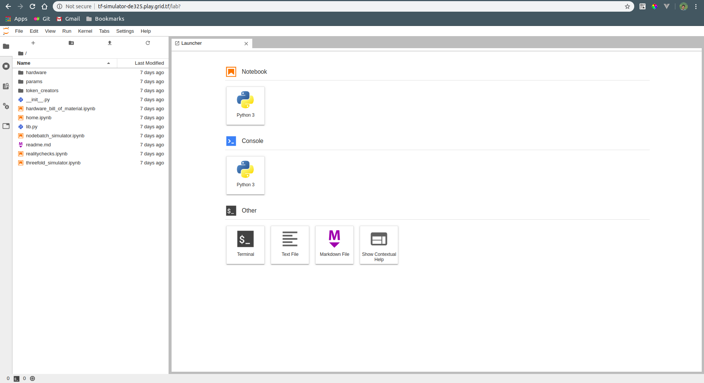

## Threefold simulator deployer

This package is used to deploy Threefold simulator on a container in the grid using a chatflow.

#### Deploy your container

- Go to [http://play.grid.tf](http://play.grid.tf)

- Choose continue then click on the next button and wait until it finish

- Click on the generated link to access your container

