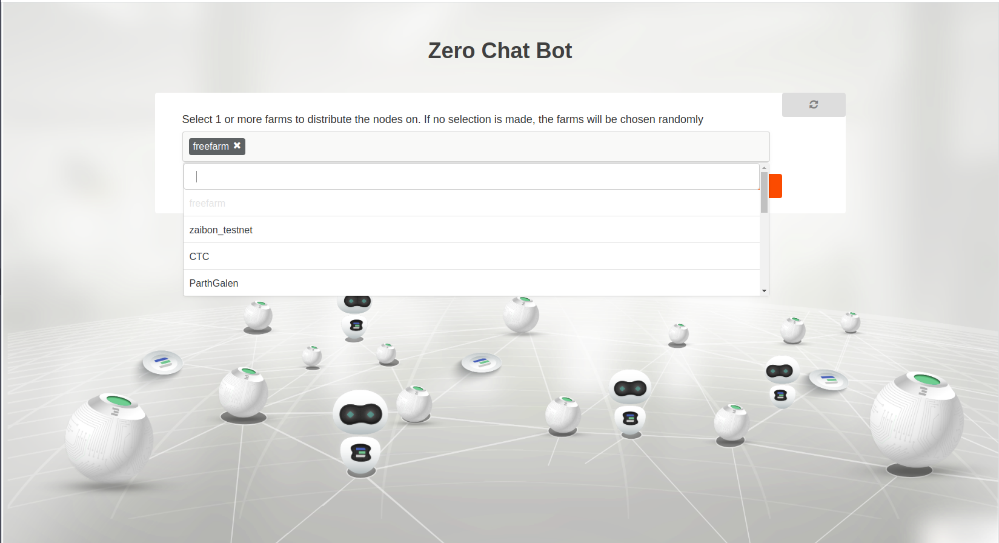
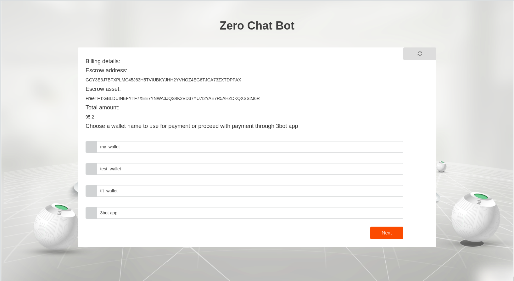

# Gitea
Gitea is a painless self-hosted Git service. It is similar to GitHub, Bitbucket, and GitLab.

## Accessing the solution

Go to your admin dashboard `https://localhost:4000/admin` and click on Gitea


## Inputs

- `container name` a name of your container to help you to get it again with reservation id.
- `ssh key` : add your public ssh key `~/.ssh/id_rsa.pub`, if your flist supports using the ssh key from the env variables provided to allow future ssh access
- `Expiration time`: a gitea expiration time.
- `Node id` : node id you would like to deploy on if left empty a node will be chosen for you
- `database name` : database name of your gitea
- `database username`: the username for your gitea database.
- `database secret`: the secret for your gitea database.
- `Repository name`: the name of repository.
- `IP Address`: choose the ip address for your gitea machine.
   

## User setup

- Register user threebot on explorer ```kosmos "j.me.configure()"```

    Note: name of 3bot is (your 3bot name).3bot , email is your 3bot email
- Install [wireguard](https://www.wireguard.com/install/)

After the deployment of the Gitea is complete, a url will be returned that can be used to access the container through web browser after up your wireguard configuration.

## Deploying Gitea Container

### Choosing the network name


Choosing the network to be used from a list of existing networks created by the user

### Choosing the solution name


Choosing the name of the solution to be deployed. This allows the user to view the solution's reservation info in the dashboard deployed solutions


### Authorizing yourself


Uploading your public key for SSH access

### Setting expiration


Now we need to tell the grid how long we want our solution to stay alive on the grid

### Database credentials 


add all database requirements (name , username of database and secret) to initialize it .

### Create Repository


Name of your repository .

### Choose a node to deploy on (optional)


Here we can provide a node id corresponding to a current node on the grid to deploy the container on. If there is no specific node to be used then it is left empty.

### Choose a farm to deploy on


If the nodeid is left empty, we can choose the farms on which the container can be deployed on. The farms are basically a group of nodes where multiple solutions can be deployed on them. We can either choose the farm name from the drop down list or leave it empty to randomly choose any farm.

### Choosing IP for the solution


Here we choose the IP to access the solution


### Payment


We select the wallet that we will pay with to proceed with the payment for the solution that will be deployed.

### Reaching your container


Here we get the container

### Gitea has been deployed

