# Ubuntu
A free and open-source Linux distribution based on Debian.
Ubuntu is officially released in three editions: Desktop, Server, and Core(for internet of things devices and robots). This package is used to deploy an ubuntu container from an official flist on the grid using a chatflow.

## Accessing the solution

Go to your admin dashboard `https://localhost:4000/admin` and click on Network


## Inputs

- `container name` a name of your container to help you to get it again with reservation id.
- `Ubuntu version`: choose ubuntu version flist for your container
- `cpu needed` : Number of cpu needed
- `memory size` : Memory size needed example 2048
- `ssh key` : add your public ssh key `~/.ssh/id_rsa.pub`, if your flist supports using the ssh key from the env variables provided to allow future ssh access
- `environment variables`: set environment variables on your deployed container, enter comma-separated variable=value For example: var1=value1, var2=value2. Leave empty if not needed
- `Expiration time`: a network expiration time (minutes=m ,hour=h, day=d, week=w, month=M)
- `IP Address`: choose the ip address for your ubuntu machine.

## User setup

- Register user threebot on explorer ```kosmos "j.me.configure()"```

    Note: name of 3bot is (your 3bot name).3bot , email is your 3bot email
- Install [wireguard](https://www.wireguard.com/install/)

After the deployment of the ubuntu is complete, a url will be returned that can be used to access the container through web browser (corex) after up your wireguard configuration.

## Deploying Ubuntu Container

### Choosing the network name

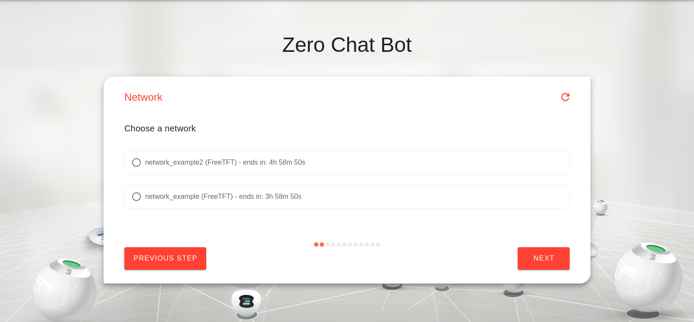
Choosing the network to be used from a list of existing networks created by the user

### Choosing the solution name

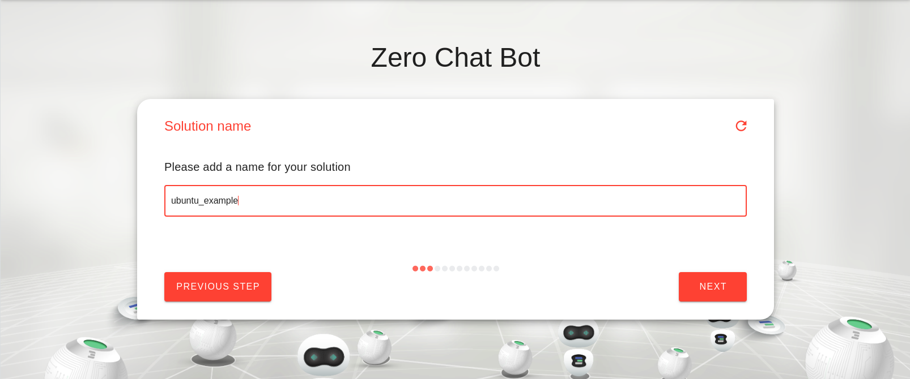
Choosing the name of the solution to be deployed. This allows the user to view the solution's reservation info in the dashboard deployed solutions

### Choosing ubuntu version

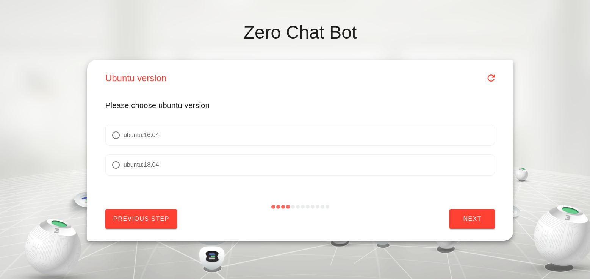
We currently support 18.04 and 16.04


### Choosing Resources for your container

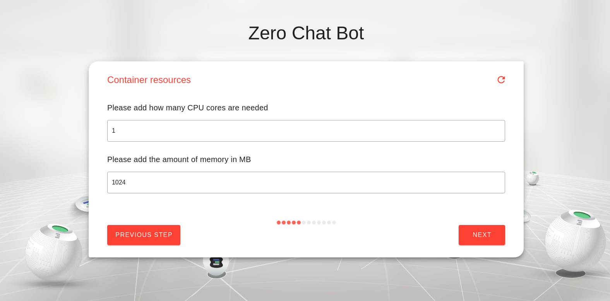
Here we specify the CPU and Memory resources allocated for the container

### Authorizing yourself

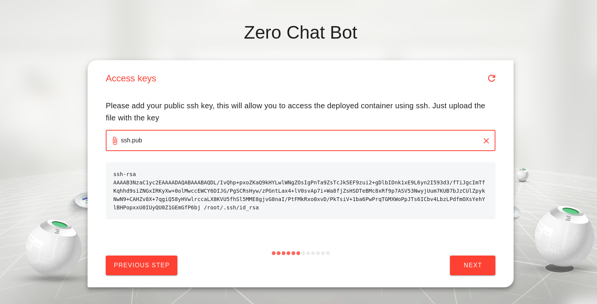
Uploading your public key for SSH access

### Setting expiration

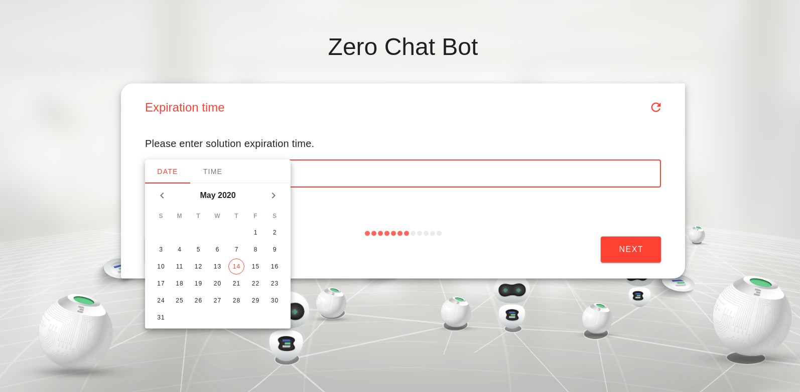
Now we need to tell the grid how long we want our solution to stay alive on the grid

### Choose a node to deploy on (optional)

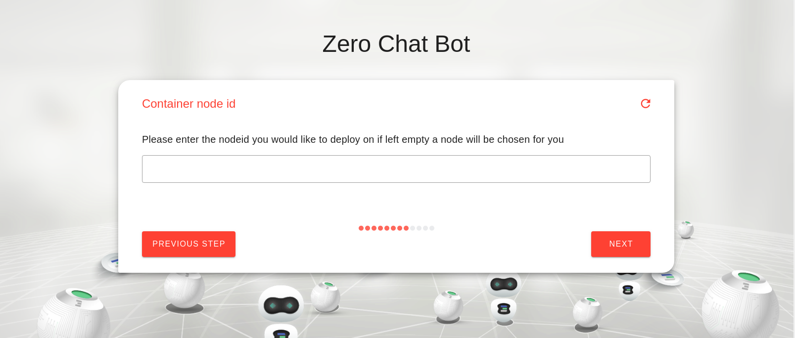

Here we can provide a node id corresponding to a current node on the grid to deploy the container on. If there is no specific node to be used then it is left empty.

### Choose a farm to deploy on

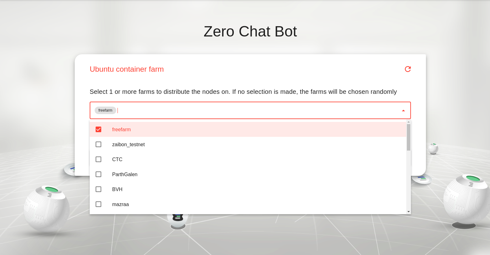

If the nodeid is left empty, we can choose the farms on which the container can be deployed on. The farms are basically a group of nodes where multiple solutions can be deployed on them. We can either choose the farm name from the drop down list or leave it empty to randomly choose any farm.

### Choosing IP for the solution

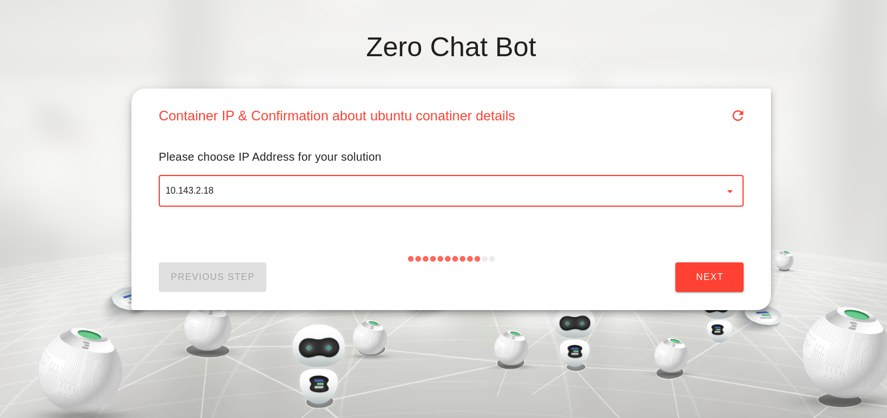
Here we choose the IP to access the solution

### Confirm your reservation

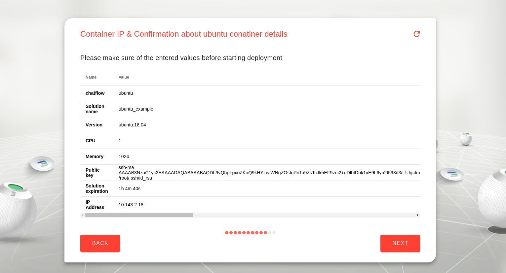
Here we confirm the specifications we entered in the chatflow

### Payment

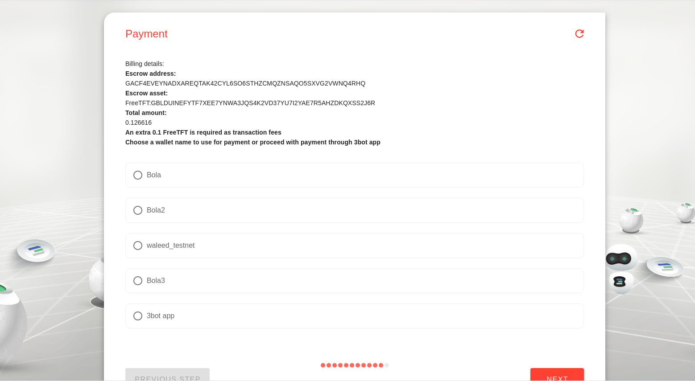
We select the wallet that we will pay with to proceed with the payment for the solution that will be deployed.

### Reaching your container

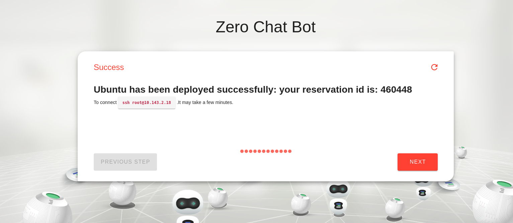
Here we get the container
