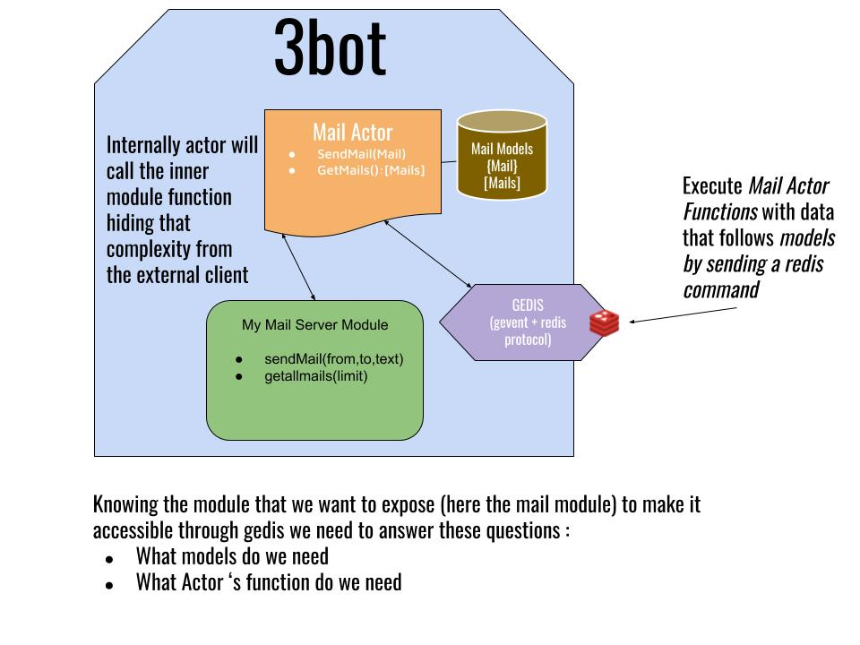

# Blog


## Start
`kosmos -p 'j.threebot.package.blog.start(BLOG_NAME, REPO_URL)'`

e.g `kosmos -p 'j.threebot.package.blog.start("xmon")'`


## Blog structure
```
.
├── images
│   └── me.jpg
├── metadata.yml
├── pages
│   ├── about.md
│   └── contactus.md
└── posts
    ├── 2019-9-8-hello-world.md
    ├── 2019-9-8-post 1.md
    ├── 2019-9-8-post 2.md
    └── 2019-9-9-bye-bye-world.md


```

## Post structure

```
---
tags: python, markdown
title: My Hello World
---

hiiiii what's up? ok


    ```

    for i in range(50):
        print("hello world")

    ```

```


## Blog metadata

```yml
blog_title: "xmonader weblog"
blog_description: "let there be posts"
blog_logo: images/blog.jpg
author_name: "ahmed"
author_email: "ahmed@there.com"
author_image_filename: "images/author.jpg"
posts_dir: "posts"
pages_dir: "pages"
images_dir: "images"
github_username: "xmonader"
posts_per_page: 5

sidebar_links:
  - title: google
    link: https://google.com
  - title: yahoo
    link: https://yahoo.com

sidebar_social_links:
  - title: facebook
    link: https://facebook.com/abc
  - title: github
    link: https://github.com/abc

nav_links:
  - title: about
    page: pages/about.md
  - title: contact us
    page: pages/contactus.md
  - title: foundation link
    link: https://threefold.io

```


## Svelte
Svelte is used for frontend


### Components
- in blog/src/components

### Routes
Done using `svelte-router-spa` in `blog/src/routers.js`

### API access
Are accessed using gedishttp client check [BlogAPI access](https://github.com/threefoldtech/jumpscaleX_threebot/blob/55c6a0d1e24d469f0235c500775b6394c326432d/ThreeBotPackages/blog/blog/src/components/blogstore.js)


### Workflow
TBD

## Actors

check [actors](https://github.com/threefoldtech/jumpscaleX_threebot/blob/development/ThreeBotPackages/blog/actors/blog.py)


# Blog

## User Stories

As a 3bot owner I want to publish a blog through the 3botApp so
that my blog will be stored on my 3bot and will be accessible from the internet to everybody

As a 3bot owner I want to publish a blog article through the 3botApp so
that my blog will be stored on my 3bot and will be accessible from the internet to everybody

As a 3bot owner I want to edit some blog articles through the 3botApp so
that my updated blog post will be stored on my 3bot and will be accessible from the internet to everybody

As a 3bot owner I want to delete a blog post through the 3botApp so
that my blog post will be erased of my 3bot and will not be accessible anymore

## Module Requirements

This module will allow :

- publish your personal blog
- add text content to your blog
- add media content (files/videos audio ?)
- assign meta data to the blog
- assign tags to a blog post
- get a list of all tags assigned to posts
- search through a list

## Technical Requirements

The content will be markdown template ?
The blog ui is based on svelte

## Threebot Actors and Models

For external entities to be able to access that threebot tft explorer we must define some methods to be called via redis protocol.
This is what we call actors and lives in the actors folder. To have an overview on how to call it please refer to the test method in the factory file.
The structure of data during those client /server exchanges are called models and are defined as schema in the models folder.

to sum up an external client would call this threebot actors method through redis protocol exchanging data according to the models.



## RUN

to start the threebot server manually

```bash
kosmos -p 'j.servers.threebot.default.start(background=False,web=False)'
```
