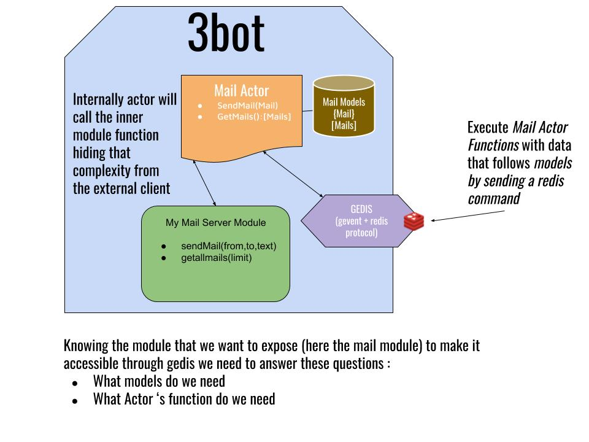

# ff connect

## Module Requirements

This module will allow :

- hold a video meeting by creating a room
- joining a room
- end a meeting (make everybody leave the room)
- modify preference audio and video ?
- share screen/doc/chat with the room ?
- **what else do we need\*** ?

## Technical Requirements

We will rely upon the jimber tech
What kind of info do we need on a ff connect ?.

- location of the room
- participants
- description
- link ?

## Threebot Actors and Models

For external entities to be able to access that threebot tft explorer we must define some methods to be called via redis protocol.
This is what we call actors and lives in the actors folder. To have an overview on how to call it please refer to the test method in the factory file.
The structure of data during those client /server exchanges are called models and are defined as schema in the models folder.

to sum up an external client would call this threebot actors method through redis protocol exchanging data according to the models.



## RUN

to start the threebot server manually

```bash
kosmos -p 'j.servers.threebot.default.start(background=False,web=False)'
```
