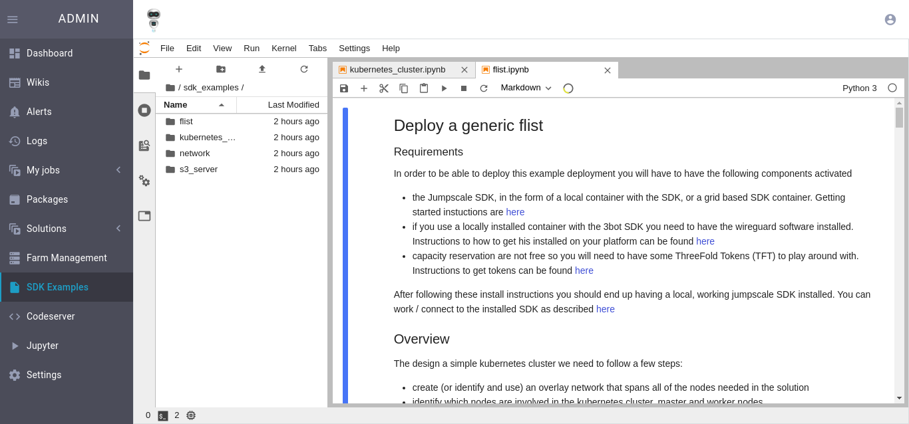
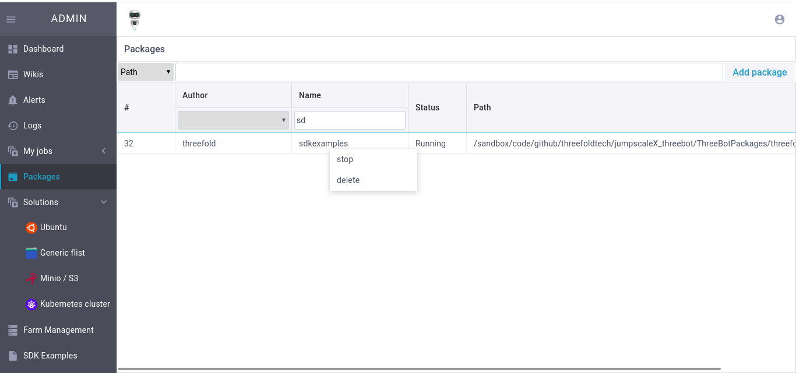

## SDK Examples

This package contains some examples about SDK
#### How to install SDK Examples package?
- Go to SDK Eamples from Admin panel
- click like the following and wait until package is installed

- After installing you should find the following 

### Adding/Removing examples
To add/remove more examples to appear directly in this folder conside modifying this path 
```
/sandbox/code/github/threefoldtech/jumpscaleX_libs_extra/JumpscaleLibsExtra/tools/threefold_simulation/sdk_examples
```
### Modifying package SDK Examples package
- Inorder to start/stop/delete package go to packages from Admin panel 
- search for sdkexamples
- Right click on it and choose the needed action


