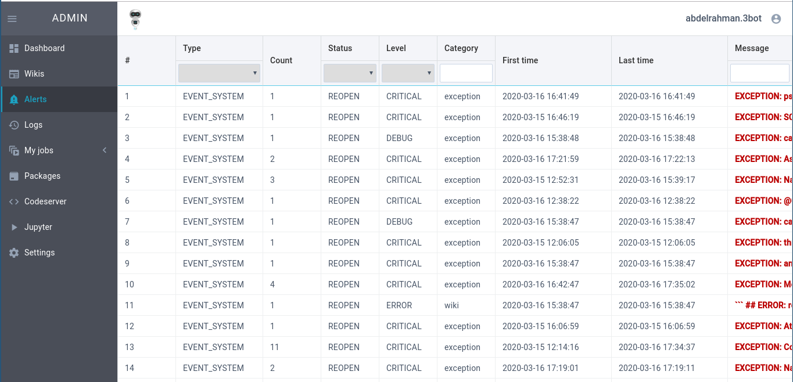

# Admin package

This package provides an admin dashboard interface with some actors for your 3Bot health, logs..etc.





### Installation

Admin dashboard is installed by default, you also can install it by path or git url as any other package.

You can view the dashboard by navigating to `http://<host>/admin`.

### Login

The dashboard is protected by 3Bot connect, you need to register your current 3Bot, from 3Bot server shell (for now, you need to suffix your name with `.3bot`):

```
j.tools.threebot.init_my_threebot()
```

Now, you can download [3Bot connect app](https://3bot.org/3bot.html) and use it to login with the 3Bot name you registered.

Also, other people can access the dashboard, but they need to be added to admins from `Settings`, Also, admins can be dded to `j.tools.threebot.me.default.admins` via `kosmos` shell:

```python3
j.tools.threebot.me.default.admins.append("ahmed.3bot")
j.tools.threebot.me.default.save()
```

### Frontend

The frontend is written in webix, and located at `frontend_src`, the build is at `frontend`, for more go to [frontend_src/README.md](frontend_src/README.md).
