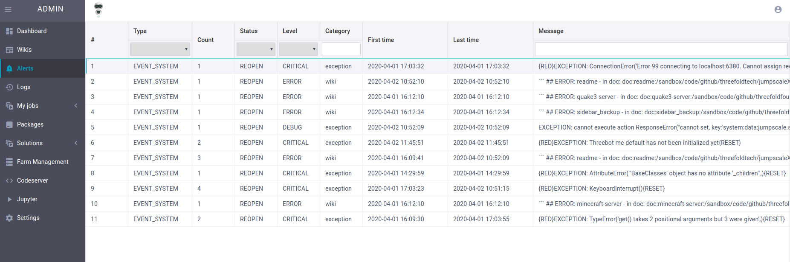
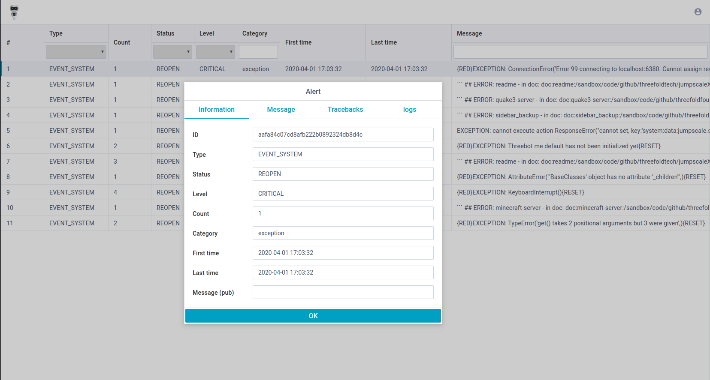
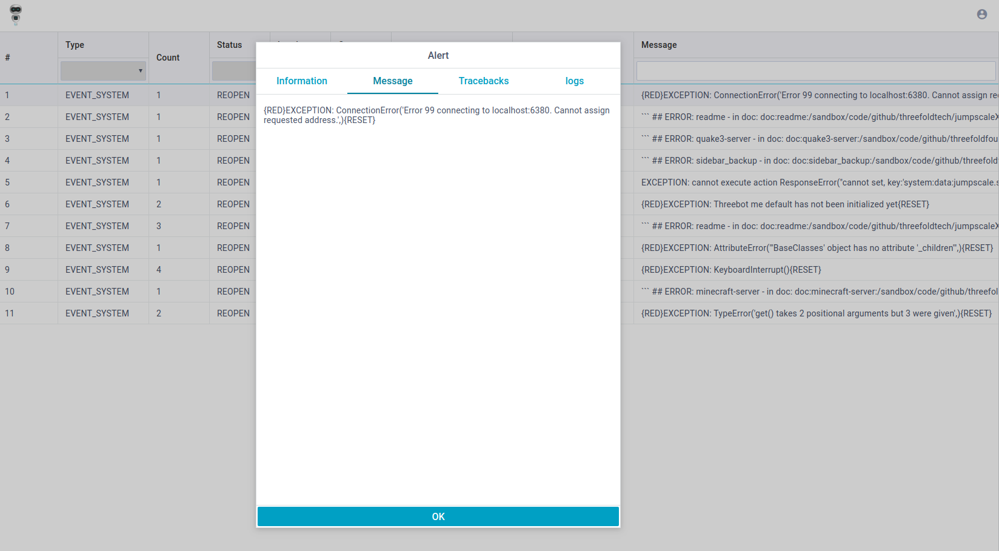
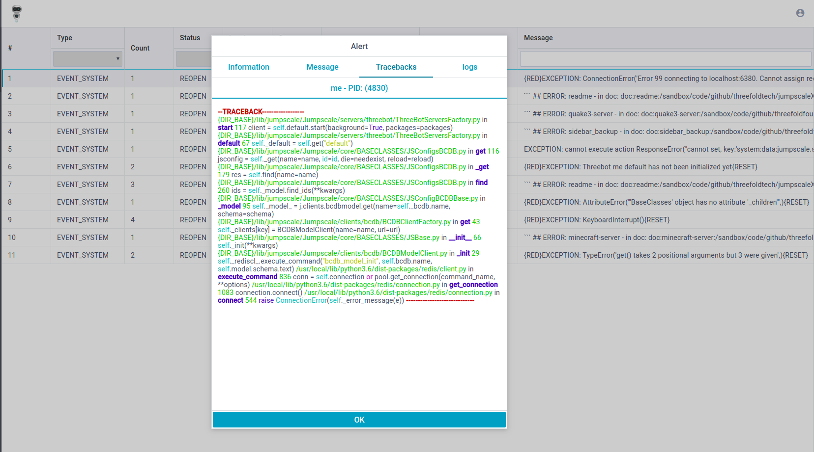
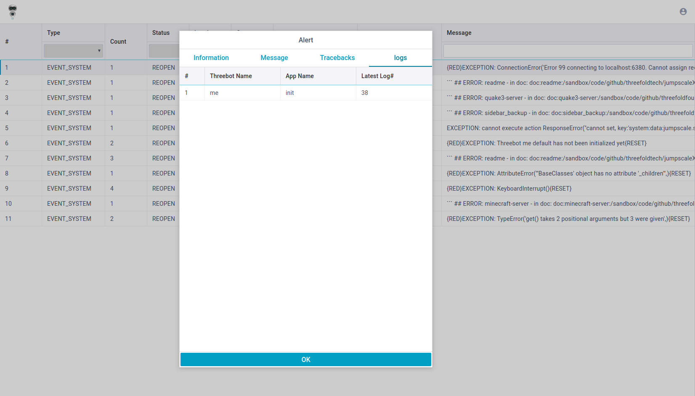

# Alerta

Central monitoring system built using Webix UI and gedis actors (with jumpscale alert handler integration).







## Running

- server will start at `https://docker_ip_address/admin/#!/main/alerts`
example:
`https://172.17.0.2/admin/#!/main/alerts`

## The package file

See [package.py](../package.py) where the following is done

- create openresty server on a port
- create a location to serve static files (or a proxy).
- add actors and expose them via gedis http interface

we left it empty as we want to use the default openresty configuration


Note that base package do some automatic loading at creation of locations.

## Actors

See [actors](../actors), for example we have alerta actor with the following methods:

- `list_alerts` : list all alerts
- `list_alerts_by_category`: get alerts by category
- `new_alert`: create new alert in system
- `get_alert`: get alert in system with identifier
- `delete_alert`: delete alert in system with identifier
- `delete_alerts`: delete some alerts in system with identifiers
- `delete_all_alerts`: delete all alerts


## Alert handler integration

Alerta can view exceptions raised inside jumpscale, by setting up alert handler tool

```
JSX> j.tools.alerthandler.setup()
```

Then any error raised will be recorded into alerts model, to test, just raise any `j.exceptions.Base` based error

```
JSX> raise j.exceptions.NotImplemented('this one is not implemented', level=10)
```

Then refresh alerta page to see it!
