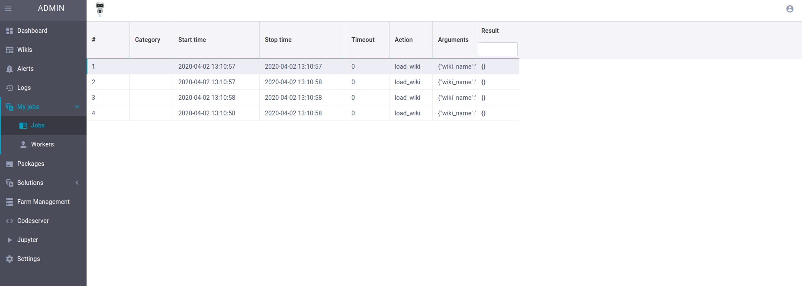
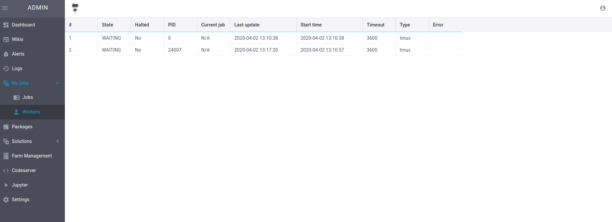

# MyJobs

Job visualizer for myjobs built using Webix UI and gedis actors.

## Running

- start your threebot `j.servers.threebot.start()`
- server will start for jobs  at `https://docker_ip_address/admin/#!/main/myjobs.jobs`
and for workers at `https://docker_ip_address/admin/#!/main/myjobs.workers`
**example** 
`https://172.17.0.2/admin/#!/main/myjobs.jobs`
`https://172.17.0.2/admin/#!/main/myjobs.workers`

## Package file

- create openresty server on a port
- create location for sapper and gedis http to access added actors

See [package.py](../package.py).

we left it empty as we want to use the default openresty configuration

## Actors

See [actors](../actors), for example, myjobs actor have the following methods:

- `list_workers`: list all the workers
- `list_jobs`: list all the jobs
