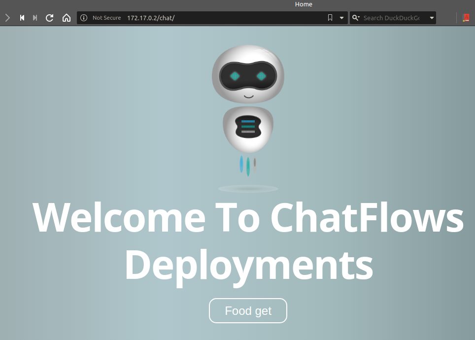
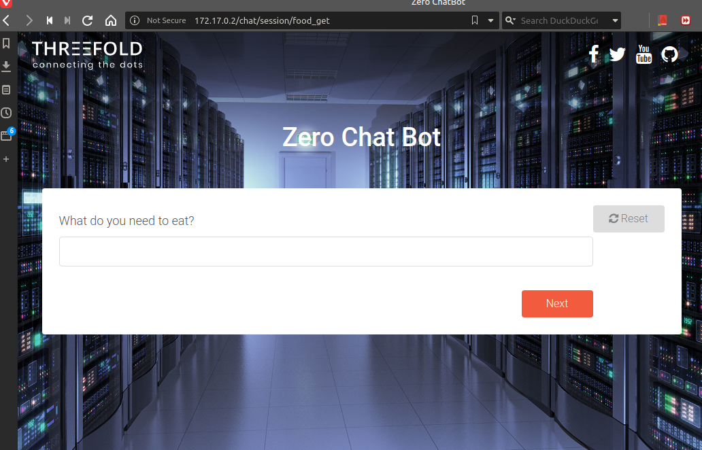
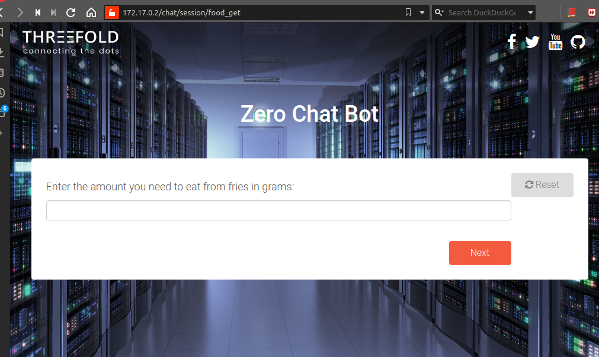
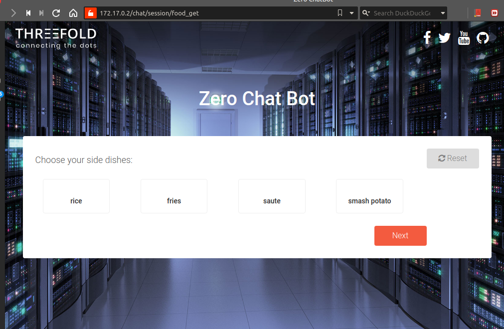
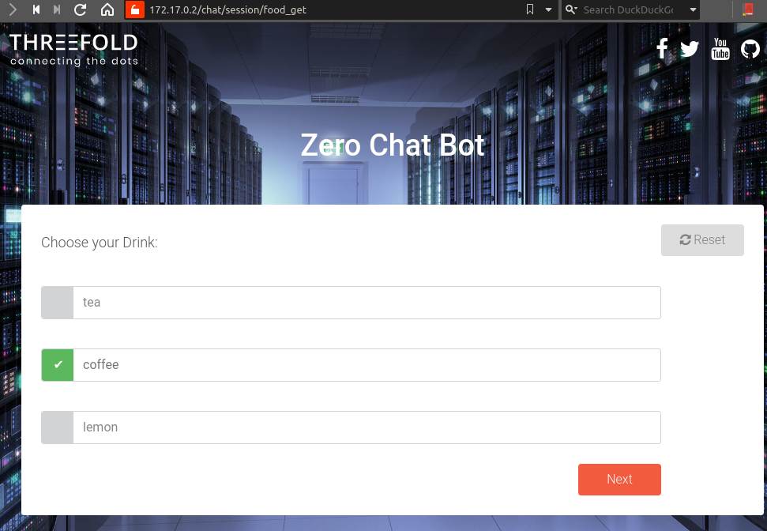
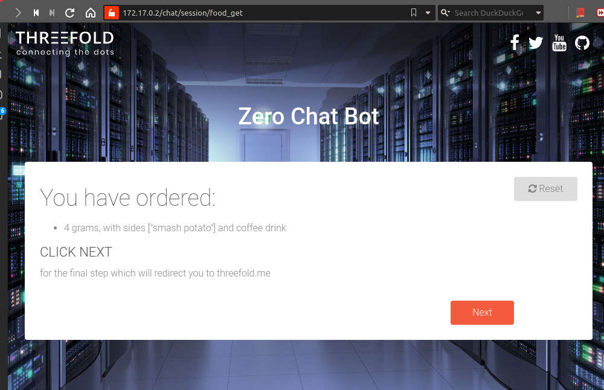

# chat package

Part of the core packages in threebot and defined [here](https://github.com/threefoldtech/jumpscaleX_threebot/blob/1c6764c8e1330c013588ec73912df25306336c5d/ThreeBotPackages/threebot/chat/README.md)

## Registaration

using the package manager
```
JSX> cl = j.servers.threebot.start()
JSX> cl.actors.package_manager.package_add("/sandbox/code/github/threefoldtech/jumpscaleX_threebot/ThreeBotPackages/threebot/chat")
JSX> cl.actors.package_manager.package_start("chat")
```

## Chatflows

Chatflows are an interactive communication bot that can be used to interactively ask the user some questions then perform
actions depending on the user's choices.

### Interacting with Chatflows

- go to `3BOT_URL/chat` to see list of available chats
- go to `3BOT_URL/chat/session/CHATFLOW_NAME` to go to specific chatflow

### Home page



### Usage

it's very easy to define a new bot, you just need to make sure it's added in a package and that package is installed. The chatflow should be under the `/chatflows` directory in the package created.

Here is an example for a simple chatflow that will help you order a meal from one of your favorite restaurants

```python
def chat(bot):
    # Sample data
    menus = {
        "3 Burger": {
            "main": ["Cheese Burger", "Douple Burger"],
            "sides": ["fries", "Onion rings"],
        },
        "3 Pizza": {
            "main": ["Chicken Pizza", "Beef Pizza", "Cheese Pizza"],
            "sides": ["fries", "Cheese"],
        }
    }

    # Ask the user about his name
    name = bot.string_ask("Hello, What's your name?")

    # display a dropdown containing your favourite Restaurants
    restaurant_name = bot.drop_down_choice("Please select a Resturant", menus.keys())

    # display the main dishes of the selected restaurant so the user can choose only one dish
    main_dish = bot.single_choice("Please Select your main dish", menus[restaurant_name]["main"])

    # ask about the mount (this accepts any integer)
    amount = bot.int_ask("How many {} do you want".format(main_dish))

    # ask about the side dishes (the user can choose multible side dishes)
    side_dish = bot.multi_choice("what do you want with your order", menus[restaurant_name]["sides"])

    # Now you can add any logic you want here to send the order to the restaurant
    # Then we can show a report to the user about his order using md format
    report = """# Hello {name}
    your order has been confirmed
    you have ordered : {amount} {main_dish] with {side_dish}
    """.format(name=name, amount=amount, main_dish=main_dish, side_dish=side_dish)

    bot.md_show(report)
```

Home page lists all of the registered chatflows

### Chatflow

We register a sample chatflow `food_get` in threebot








For more technical information on the chat package please check [Internals page](./internals.md)

### Available question types:

- string_ask
- password_ask
- text_ask
- int_ask
- single_choice
- multi_choice
- drop_down_choice
