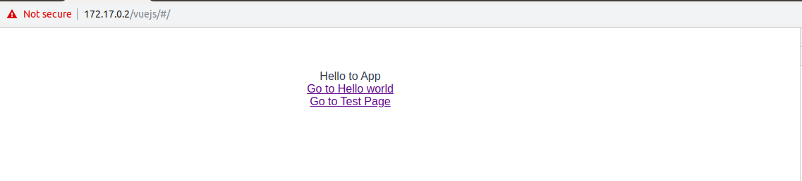

# An example for vuejs using vue-cli

To start the package in `kosmos` use the following:

```python
JSX> cl = j.servers.threebot.start()
JSX> cl.actors.package_manager.package_add(path="/sandbox/code/github/threefoldtech/jumpscaleX_threebot/ThreeBotPackages/examples/vuejs/")
```

## What to expect

A vuejs example integrated with threebot server that has threepages:

- main page (conains a route for the other two)



- Hello world (conatin an image to make sure assets works)


- Test Page (will get some stored data from threebotserver actor)


## How to serve at different locations

At package.py just change the dev env accroding to your need os.environ["dev"] = "1"

**Note** (default 1): development mode will serve at `/location-example`, Specify the location within the next variable
`self.mylocation = "/vuejs"`

0: Production mode will serve at `/`

## Internals

## BackEnd

Create a package: check package creation instructions [Here](https://github.com/threefoldtech/jumpscaleX_threebot/blob/development/docs/quickstart.md)

- Endpoint

  To use development mode which will serve your site at a location `/vuejs`
  in `package.py` init set the DEV variable = 1 otherwise will serve your site at `/`

  ```python
  def _init(self, **kwargs):
    # CHANGE ME (default 1: development mode)
    os.environ["dev"] = "1"
    self.mylocation = "/vuejs"
    self.DEV = os.environ.get("dev")
  ```

- Models

  Models are in `models/` dir create the jumpscale models u want in a toml style
  example:

  ```toml
  @url = jumpscale.example.vuejs
  myname** = "" (S)
  job = "" (S)
  aboutme = "" (S)
  ```

- For `package.py`

  For Prepare method it will build the frontend stuff and make it ready to be served,
  This will copy the vuejs's files (html(s), css(s) and js(s) files) to our serving dir `html` dir

  ```python
  def prepare(self):
      """
      is called at install time
      :return:
      """
      prepare_cmd = f"""
      cd {self.package_root}
      pushd newproject
      export dev={self.DEV}
      npm install
      npm run build
      popd
      cp newproject/dist/* html/ -R
      """
      j.sal.process.execute(prepare_cmd)
  ```

  For start method, It follows the threebot's `spa` way like alerta package
  in configuring the openresty locations

  ```python
  def start(self):
      """
      called when the 3bot starts
      :return:
      """
      server = self.openresty
      server.install(reset=False)
      server.configure()

      website = server.get_from_port(443)

      locations = website.locations.get(f"{self.mylocation}_locations")

      website_location = locations.locations_spa.new()
      website_location.name = self.mylocation
      if self.DEV == "1":
          website_location.path_url = self.mylocation
      else:
          website_location.path_url = "/"

      website_location.use_jumpscale_weblibs = False
      fullpath = j.sal.fs.joinPaths(self.package_root, "html/")
      website_location.path_location = fullpath

      locations.configure()
      website.configure()
  ```

  - Actors:
  Actors available in `actors/`, using the model we created to save/get data in bcdb.
  actors are the interface you talk to gedis/backend with, it takes schema in for the input parameters and out for return values.

  example actor `actors/vuejs.py`
