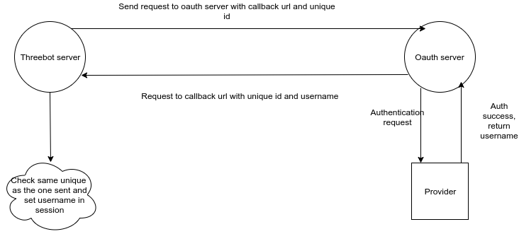

# Oauth2 chat flow

## Central Oauth2 server

All authentication are done by [https://oauth2.3bot.grid.tf](https://oauth2.3bot.grid.tf), which will direct the user to the specified provider(e.g github).
The server will authenticate with the configured oauth2 data(client id, secret,..) and upon success will direct the user back to his threebot.

there are two endpoint in this server
- ```/auth/authorize/<provider_name>```: authorization url
- ```/auth/callback/<provider_name>```: callback url
### Support new provider

#### Create oauth2 application
To support new provider you need to create an oauth2 application and set the callback with ```https://oauth2.3bot.grid.tf/auth/callback/<provider_name>``` 

#### Register the new provider
To register the new provider to the server use `site_providers` client:

```python
client  = j.clients.site_providers.get("oauth2.3bot.grid.tf")
client.provider_add(
        "provider_name",
        "client_id",
        "client_secret",
        "access_token_url",
        "authorize_url",
        "redirect_url",
        "scope",
        "user_info_url",
        "login_field" 
)

# To make sure it was added

client.provider_list()
```

The server should be able to support this provider now.

## The flow



The following end points were added for this flow:

- `/chat/login`: Renders login page from which it is possible to select the provider. Will redirect here if user is not logged in. Will send the provider and the uuid as well as the callback endpoint.

- `/chat/authorize`: Is the callback for the oauth server to return the data to. Verifies the uuid is the same as the one sent and sets the username in the session.

By default chat pages can be accessed without logging in. To force authentication on an endpoint we use the `auth` wrapper.
The wrapper will check if the username is stored in the session or not otherwise it will redirect to the login page.
