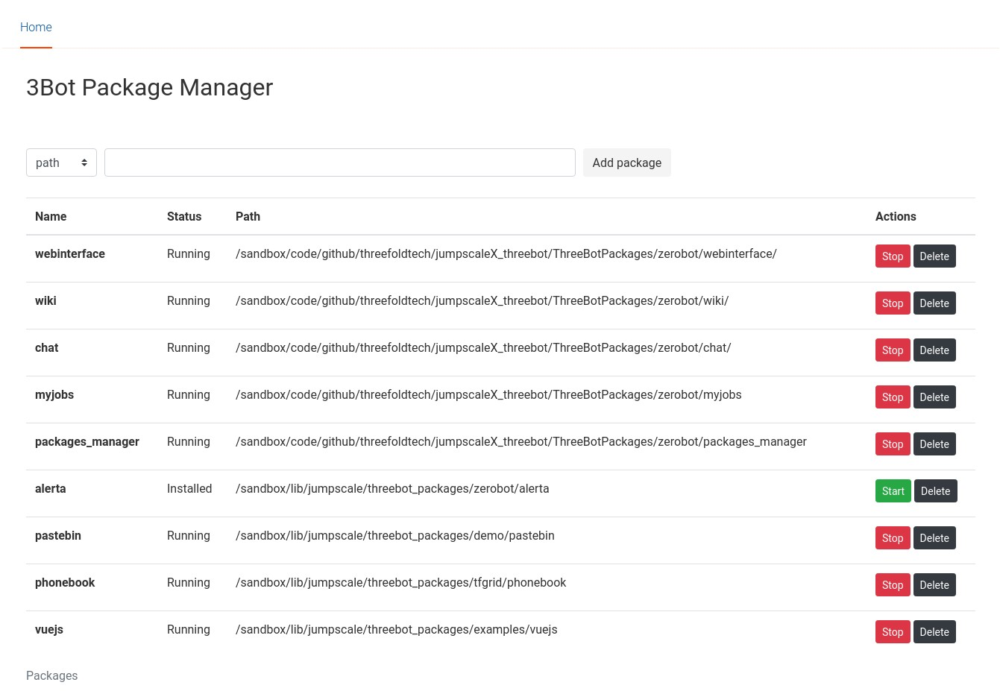

# Content:
- [What is a package](#what-is-a-package)
- [Creating a new package](#creating-a-new-package)
- [Registering package](#registering-package)
- [Package structure](#package-structure)
- [Locations](#locations)
- [Authentication](#authentication)
- [Example package.toml](#example-package.toml)
- [Example package.py](#example-package.py)

## What is a package

Package is the way to write extensions and applications to threebot server and it is driven using `package.py` file which controls the life cycle of the application, including configurations (prepare) , start, stop .. etc.


## Creating a new package

You can create a new package using `package-new` jsx subcommand to scaffold a new package
```
3BOTDEVEL:3bot:tmp: jsx package-new --name hello
3BOTDEVEL:3bot:tmp: tree hello/
hello
├── actors
│   └── hello.py
├── chatflows
│   └── hello.py
├── HelloFactory.py
├── models
├── package.py
├── package.toml
└── wiki
```

## Registering package

#### Using package manager actor

After starting the server with the recommended way, the package created can be added using the package manager (It's implemented as a package too and loaded by default):

Directly from threebot shell:

```
j.threebot.packages.zerobot.packagemanager.actors.package_manager.package_add(path='/sandbox/code/github/threefoldtech/jumpscaleX_threebot/ThreeBotPackages/zerobot/alerta')
```

Or through a client from another process:

```
kosmos -p
JSX> cl = j.clients.gedis.get(name="pm", port=8901, package_name="zerobot.packagemanager")
JSX> cl.reload()
JSX> cl.actors.package_manager.package_add(path='/sandbox/code/github/threefoldtech/jumpscaleX_threebot/ThreeBotPackages/zerobot/alerta')
```

#### Using the package manager UI
After starting threebot you can go to `3BOT_URL/zerobot/packagemanager`



## Package structure
- **Models directory** registers the model on the package loading. There is no need to manually add the models

    _note_: Crud model actors are automatically generated and added to the package actors, to disable this option add `disable_crud = true` to the package.toml file
- **Actors directory** is registered automatically when loading the package. There is no need to manually add actors, they can be accessed via http at `3BOT_URL/<threefold_name>/<package_name>/actors/<actor_name>/<actor_method>`.
- **Wiki directory** is loaded automatically and can be accessed via `3BOT_URL/<threefold_name>/<package_name>/wiki`.
- **Chatflows directory** is loaded automatically, can be access via `3BOT_URL/<threefold_name>/<package_name>/chat`.

- **package.py**  is where the  package logic is defined.

    For packages that need their own bcdb, you need to override bcdb property like this

    ```python
    class Package(j.baseclasses.threebot_package):
        @property
        def bcdb(self):
            return self.threebot_server.bcdb_get("your_name")

        ...
    ```
- **package.toml**  is where the package information is defined, such as bcdb's and actors' namespaces.

## Locations
Detailed types of `openresty/nginx` locations that can be defined inside are documented [here](locations.md).

## Authentication
We provide oauth2 proxy and clients, see [documentation](oauth2/README.md) of how you can use them inside your package.

## Example package.toml

```toml
[source]
name = "demo"
description = "mypackage"
threebot = "zerobot"
version = "1.0.0"

[actor]
namespace = "zerobot"

[[bcdbs]]
name = "zerobot_demo"
namespace = "zerobot_demo"
type = "zdb"
instance = "default"
```

## Example package.py


Packages does the lifecycle management of your application

typical `package.py` should look like

```python
from Jumpscale import j


class Package(j.baseclasses.threebot_package):
    pass

```

In case you wanted to do more, creating proxies, special locations .. etc it may look like the following

```python
from Jumpscale import j


class Package(j.baseclasses.threebot_package):
    def setup_locations(self):
        """
        ports & paths used for threebotserver
        see: {DIR_BASE}/code/github/threefoldtech/jumpscaleX_core/docs/3Bot/web_environment.md
        will start bottle server web interface which include (gedis http interface, gedis websocket interface and
        bcdbfs web server)
        endpoints:
        "/web/gedis/http"       >    gedis htto interface
        "/web/gedis/websocket"  >    gedis websocket interface
        "/web/bcdbfs"           >    bcdbfs web server
        "/weblibs"              >    static jumpscale weblibs files
        """

        self.openresty.configure()

        # get our main webserver
        for port in (443, 80):
            website = self.openresty.get_from_port(port)

            # PROXY for gedis HTTP
            locations = website.locations.get(name="webinterface_locations")

            package_actors_location = locations.locations_proxy.new()
            package_actors_location.name = "package"
            package_actors_location.path_url = "~* /(.*)/(.*)/actors/(.*)/(.*)$"
            package_actors_location.ipaddr_dest = "127.0.0.1"
            package_actors_location.port_dest = 9999
            package_actors_location.path_dest = ""
            package_actors_location.type = "http"
            package_actors_location.scheme = "http"

            ## more code omitted.


            website.configure()

    def start(self):

        # add the main webapplication

        self.setup_locations()

        from threebot_packages.zerobot.webinterface.bottle.gedis import app

        self.gevent_rack.bottle_server_add(name="bottle_web_interface", port=9999, app=app, websocket=True)
        # self.gevent_rack.webapp_root = webapp

```

### Custom configs for package

```
JSX> p.zerobot.chatbot_examples.install(install_kwargs={"mode":"staging"})     
JSX> p.zerobot.chatbot_examples.start()                                        
```


- `self._package.install_kwargs` to can be used to access the `install_kwargs` in `package.py`
- `self.package.install_kwargs` can be used to access the `install_kwargs` in the actors

