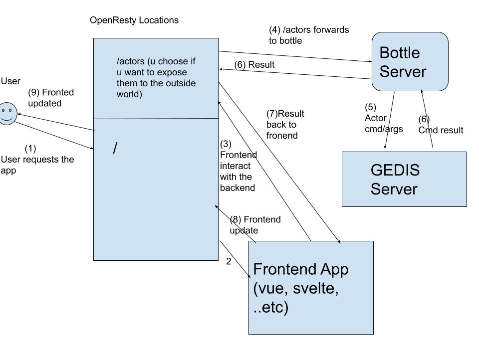

# threebot application



application is driven using `package.py` file which controls the life cycle of the application, configurations (prepare) , start, stop .. etc

## Starting threebot with registered packages
- the recommended way is `j.servers.threebot.local_start_default()`.

- to simplify the development workflow you can start packages directly using their factories, for example:
    * `kosmos -p "j.threebot.package.alerta.start()"`

## Registering package (using package manager)
After starting the server with recommended way, you can use the returned client to access package manager actor and add your package, for an example starting alerta package:


```
kosmos -p
JSX> cl = j.servers.threebot.local_start_default(web=True)
JSX> cl.actors.package_manager.package_add(path='/sandbox/code/github/threefoldtech/jumpscaleX_threebot/ThreeBotPackages/alerta')
```

## Package structure
- models directory registers the model on the package loading. no need to manually add the models
- actors directory is registered automatically when loading the package no need to manually add actors

- package.py  where you define your package logic
- PACKAGE_NAME_Factory the entry point for your package so it can be referenced within jumpscaleX ecosystem

- for packages that need their own bcdb, you need to override bcdb property like this

```python
class Package(j.baseclasses.threebot_package):
    @property
    def bcdb(self):
        return self.threebot_server.bcdb_get("your_name")

    ...
```


## Example factory

```python
from Jumpscale import j


class PastebinFactory(j.baseclasses.threebot_factory):

    __jslocation__ = "j.threebot.package.pastebin2"
```

## Example package.py


Packages does the lifecycle management of your application

```python
from Jumpscale import j


class Package(j.baseclasses.threebot_package):
    def start(self):
        """
        called when the 3bot starts
        :return:
        """
        server = self.openresty
        server.install(reset=False)
        server.configure()

        website = server.get_from_port(443)

        locations = website.locations.get("pastebin_locations")

        website_location = locations.locations_spa.new()
        website_location.name = "pastebin"
        website_location.path_url = "/"
        website_location.use_jumpscale_weblibs = False
        fullpath = j.sal.fs.joinPaths(self.package_root, "html/")
        website_location.path_location = fullpath

        locations.configure()
        website.configure()


```

## APIs (actors)

```python
from Jumpscale import j


class pastebin(j.baseclasses.threebot_actor):
    def _init(self, **kwargs):

        from random import choice

        paste_schema = """
        @url = jumpscale.pastebin.paste
        code = "" (S)
        """

        self.paste_model = j.data.bcdb.system.model_get(schema=paste_schema)
        for i in range(10):
            paste = self.paste_model.new()
            paste.code = """print("hello")"""

    def get_paste(self, paste_id, schema_out=None, user_session=None):
        paste = j.data.serializers.json.dumps(self.paste_model.get(paste_id)._ddict)
        return paste

    def new_paste(self, code, schema_out=None, user_session=None):
        paste = self.paste_model.new()
        paste.code = code
        paste.save()
        res = j.data.serializers.json.dumps(paste._ddict)
        return res

```
- the actors of your registered packages are exposed on http endpoint `/web/gedis/http` more [here](https://github.com/threefoldtech/jumpscaleX_core/blob/be2496d7ca03ad1cbf43caa2b9ec132ae471598a/JumpscaleCore/servers/gedis_http)

- if you want to communicate over websocket (unrecommended) use `/web/gedis/http_websocket
- http/websocket clients available [here](https://github.com/threefoldtech/jumpscaleX_weblibs/tree/master/static/gedis) as well

or if you want to use pure http client, here's an example in javascript
```javascript
import axios from 'axios'

export function getPaste(pasteId) {
    return (axios.post("/web/gedis/http/pastebin/get_paste", { "args": { "paste_id": pasteId } }))
}

export function newPaste(code) {
    return (axios.post("/web/gedis/http/pastebin/new_paste", { "args": { "code": code } }))
}
```

# Locations
As you already figured out we use `openresty` for running applications and proxying requests based on their locations. There're multiple types

### Static:
Used to serve static assets directly (should use that for your css, js, images).

The following example creates a `/static` location to server some static files with [weblibs](https://github.com/threefoldtech/jumpscaleX_weblibs).

```python
class Package(j.baseclasses.threebot_package):

    def start():
        website = self.openresty.get_from_port(443)
        locations = website.locations.get("<my locations name>")

        static_location = locations.locations_static.new()
        static_location.name = "<location name>"
        static_location.path_url = "/static"
        static_location.path_location = "<static files location>
        static_location.use_jumpscale_weblibs = True # if set, will copy weblibs and serve it from /static/weblibs directly

        locations.configure()
        website.configure()
```

### Proxy
To `proxy` to requests on certain location to a running server.

The following examples creates a proxy on `/calendar` which will redirect requests to `0.0.0.0:8851/`, note `ipaddr_dest`, `port_dest`, `path_dest` and `schema` as these are very important for the proxy to work properly.

```python
class Package(j.baseclasses.threebot_package):

    def start():
        wsgi_app = ...  # get for example Bottle.app()
        rack = self.threebot_server.rack_server

        rack.bottle_server_add(name="calendar", port=8851, app=wsgi_app)
        website = self.openresty.get_from_port(443)

        locations = website.locations.get("calendar")
        proxy_location = locations.locations_proxy.new()
        proxy_location.name = "calendar"
        proxy_location.path_url = "/calendar/"
        proxy_location.ipaddr_dest = "0.0.0.0"
        proxy_location.port_dest = 8851
        proxy_location.path_dest = "/"
        proxy_location.scheme = "http"

        locations.configure()
        website.configure()
```

### Single page apps (SPA)
A special location to serve SPA (e.g. sapper exported) directories mainly.

The following example create an SPA location that serves the build directory of `html`.

```python
class Package(j.baseclasses.threebot_package):

    def start(self):
        server = self.openresty
        website = server.get_from_port(443)
        locations = website.locations.get("myjobs_locations")

        website_location = locations.locations_spa.new()
        website_location.name = "myjobs"
        website_location.path_url = "/myjobs"
        website_location.use_jumpscale_weblibs = False
        fullpath = j.sal.fs.joinPaths(self.package_root, "html/")
        website_location.path_location = fullpath

        locations.configure()
        website.configure()
```


### Custom
You can add there whatever configurations you want.

```python
class Package(j.baseclasses.threebot_package):

    def start(self):
        server = self.openresty
        website = server.get_from_port(443)
        locations = website.locations.get("<locations name>")

        website_location = locations.locations_cusotm.new()
        website_location.name = "<location name>"
        website_location.config = """
        location /mypath {
            index index.html
            alias /path/to/files
        }
        """

        locations.configure()
        website.configure()
```


# Webinterface package

[Webinterface](https://github.com/threefoldtech/jumpscaleX_threebot/blob/c58b3db99095a8a9635c75ac7f82647947a9d110/ThreeBotPackages/threebot/webinterface) package is always registered when starting your threebot responsible for
- exposing http endpoints for actors
- exposing websocket endpoints for actors
- exposing bcdbfs endpoints


# Complete examples

- Myjobs

  - [backend](https://github.com/threefoldtech/jumpscaleX_threebot/blob/development/ThreeBotPackages/myjobs/README.md)
  - [frontend](https://github.com/threefoldtech/jumpscaleX_threebot/blob/development/ThreeBotPackages/myjobs/JobsVisualSvelte/README.md)

- Alerta - [backend](https://github.com/threefoldtech/jumpscaleX_threebot/blob/development/ThreeBotPackages/alerta/README.md) - [frontend](https://github.com/threefoldtech/jumpscaleX_threebot/blob/development/ThreeBotPackages/alerta/alerta/README.md)
- Pastebin
  - [backend](https://github.com/threefoldtech/jumpscaleX_threebot/blob/development/ThreeBotPackages/pastebin/README.md)
  - [frontend](https://github.com/threefoldtech/jumpscaleX_threebot/blob/development/ThreeBotPackages/pastebin/pastebin/README.md)
