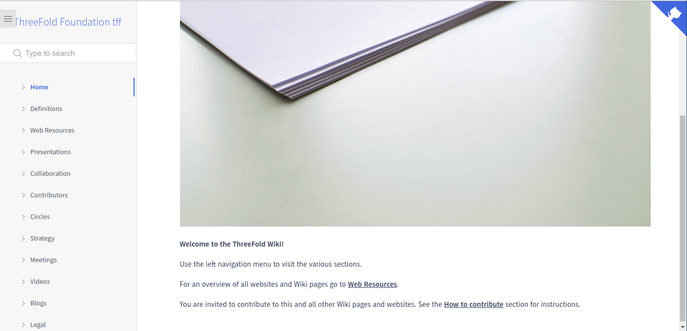

# Wikis

Wikis are a collection of docsites, which are a collection of markdown documents, images and files.

A [simple docsite](examples/simple) can only consists of two files, `README.md` and `_sidebar.md`, the later is used for navigation in [docsify.js](https://docsify.js.org/#/more-pages?id=sidebar).

We use [docsify.js](https://docsify.js.org/) to get an html web page directly from markdown, we also use our [3git](https://github.com/threefoldtech/jumpscaleX_core/tree/development/JumpscaleCore/tools/threegit) tool to pre-process this docsites to support some markdown extenstions like [macros](macro/README.md).

Some wikis can be found at [threefoldfoundation](https://github.com/threefoldfoundation) organization on github like:
* [Foundation](https://github.com/threefoldfoundation/info_foundation)
* [Tokens](https://github.com/threefoldfoundation/info_tokens)

All wikis are now hosted at [https://wiki.grid.tf/](https://wiki.grid.tf/), for example foundation wiki can be found at [https://wiki.grid.tf/wiki/foundation](https://wiki.grid.tf/wiki/foundation).

Editing the content of this wikis are done collaboratively at the previous repositories, as mentioned earlier, you can use our custom markdown extensions like:

* [Macros](macro/README.md)
* [Custom link format](links.md)
* [Inline HTML](html.md)

## Running your own wiki
ًWikis are supported by default in threebot packages, to run and setup your own package with a wiki, more technical documentation can be found [here](tech/README.md).
