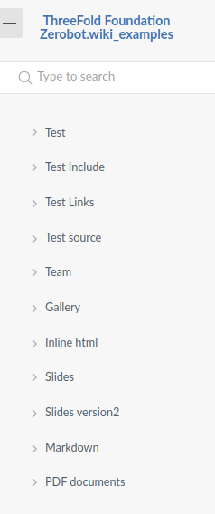
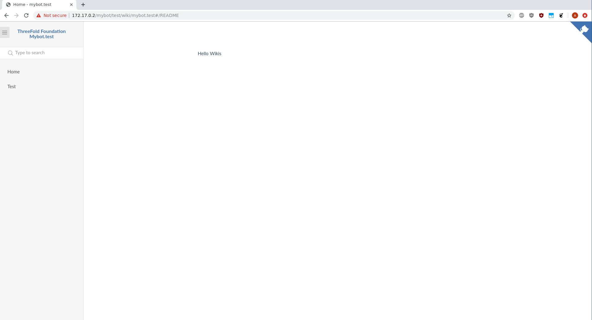
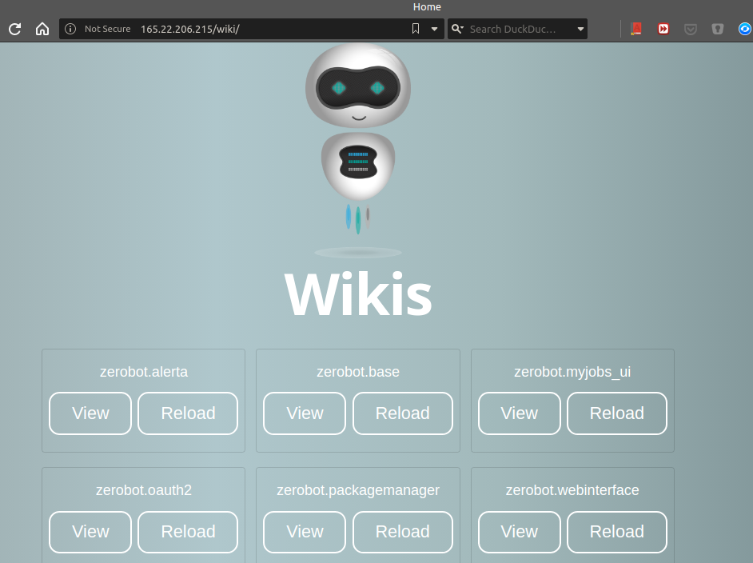

# Docsites:

Docsites are a collection of markdown documents, images and data files that can be generated using jumpscale `3git` tool.

The tool pre-process the given markdown directory (it adds some extension to markdown like custom link format and macros), also, it verifies and follows all the links and download it if needed, so you end up having a static directory that can be served directly.

Content:

* [Loading wikis](#loading-wikis)
* [Loading wikis using jsx wiki-load](#Loading-wikis-using-jsx-wiki-load)
* [Creating and adding a new package](#creating-and-adding-a-new-package)
* [Reloading the wiki of any package](#reloading-the-wiki-of-any-package)
* [Reloading wikis using jsx wiki-reload](#reloading-wikis-using-jsx-wiki-reload)
* [Markdown extensions](#markdown-extensions)
* [Writing your own macro](#writing-you-own-macro)
* [Setting up gdrive and service account](#setting-up-gdrive-and-service-account)

## Loading wikis

Loading wiki is now done by default in any threebot package, you just need to create a new package and add your content inside `wiki` directory of this package. When this package is added to threebot server via `package_manager` for example, it will load the content and process it automatically using `3git` tool.

First make sure you have a threebot server running using:

```bash
3BOTDEVEL:3bot:~: kosmos -p 'j.servers.threebot.start()'
```

## Loading wikis using jsx wiki-load

* First make sure you have a threebot server running `kosmos -p 'j.servers.threebot.start()'`
* then load your wikis using `jsx wiki_load`

* Example:

```bash
jsx wiki-load -u https://github.com/threefoldtech/jumpscaleX_threebot/tree/development/docs/wikis/examples/docs -n examples -f
```

- `-u` or `--url` : docsite url
- `-n` or `--name`: wiki name to be used in the url `/wiki/wiki_name`
- `-f` to load in foreground if not it'll use myjobs in the background
- `-r` or `--reset"` reset git revision and process all files

- Opening the browser to `/wiki/wiki_name` and you will find loaded wikis (may take some time to load).

## Creating and adding a new package

You can create a new package with the default directory structure using:

```
3BOTDEVEL:3bot:~: jsx package-new --name test --dest .
```

This will result in the following tree:

```
3BOTDEVEL:3bot:~: tree test
test
├── actors
│   └── test.py
├── chatflows
│   └── test.py
├── models
├── package.py
├── package.toml
├── TestFactory.py
└── wiki

4 directories, 5 files
```

Before adding content, make sure this package directory is a git repository with at least a single commit, because `3git` tool keep track of the changes using `git` and only process changed files every time, you simply do:

```
3BOTDEVEL:3bot:test: git init .
Initialized empty Git repository in /root/test/.git/
3BOTDEVEL:3bot:test: git add .
3BOTDEVEL:3bot:test: git commit -m "init"
```

Then, adding for example `_sidebar.md`, `README.md` and `test.md` documents with any content:

```
3BOTDEVEL:3bot:~: tree test/wiki/
test/wiki/
├── README.md
├── _sidebar.md
└── test.md

0 directories, 3 files
```

### Configuring sidebar using _sidebar.md
Docsify allows configuring the sidebar for navigation

Here's an example used to produces the following sidebar



```markdown
* [Test](test.md)
* [Test Include](test_include.md)
* [Test Links](test_links.md)
* [Test source](test_src.md)
* [Team](test_team.md)
* [Gallery](test_gallery.md)
* [Inline html](test_html.md)
* [Slides](test_presentation.md)
* [Slides version2](test_presentation_v2.md)
* [Markdown](test_markdown.md)
* [PDF documents](test_gpdf.md)

```


For more information  [Docsify config](https://docsify.now.sh/configuration) and [Docsify sidebar](https://docsify.now.sh/more-pages?id=sidebar)


After filling `wiki` directory with content, you can add the package now via threebot package manager:

```
3BOTDEVEL:3bot:~: kosmos -p
JSX> cl = j.clients.gedis.get("pm", port=8901, package_name="zerobot.packagemanager")
LOAD CONFIG BCDB
JSX> cl.actors.package_manager.package_add(path="/root/test")
b'OK'
```

Now to navigate to the wiki in the browser, need to know the package name and parent threebot name (they can be specified inside `package.toml`)

```
3BOTDEVEL:3bot:~: cat test/package.toml

[source]
name = "test"
description = "mypackage"
threebot = "mybot"
version = "1.0.0"


[[bcdbs]]
namespace = "mybot"
type = "zdb"
instance = "default"
```

Opening the browser to `http://<threebot or container address>/mybot/test/wiki` and you will find loaded wikis (may take some time to load).


Inside the wiki:




## Reloading the wiki of any package

### Reloading from the UI


### Reloading from command line

To reload a wiki of a specific package, you just need to get an instance from this package (make sure it was added before).

```
JSX> p = j.tools.threebot_packages.get("mybot.test")
LOAD CONFIG BCDB
JSX> p.wiki_load(reset=True)
** START DATA PROCESSOR FOR :myjobs
```

## Reloading wikis using jsx wiki-reload

- First make sure you have a threebot server running `kosmos -p 'j.servers.threebot.start()'`

- using `jsx wiki-reload -n "your-wiki-name"` ex. foundation, testwikis .. this will look for the changes in the repo locally, if not will pull it from github and update the changes.

- `-n` or `--name` name of the wiki, you're given name
- `-r` or `--reset` reset git revision and process all files

## Markdown extensions:

* [Custom link format](../links.md)
* [Macros](../macro/)
* [Inline HTML](../html.md)

## Writing you own macro
[Macros](../macro) can extend markdown, we have different types of macros to do many operations, also, you can write your own macro as [described here](macro.md).

## Setting up gdrive and service account

Gdrive extension and `gslide/slideshow` macros require google service account credentials to work properly.

* [Service account](service_account.md)
* [GDrive](gdrive.md) serve your google documents, sheets and slides directly from wikis.
