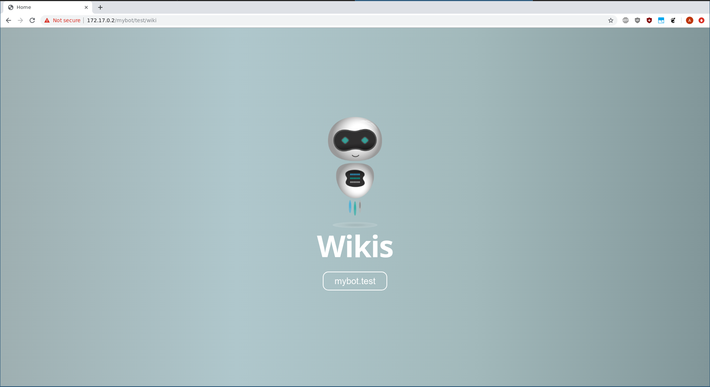

# Docsites:

Docsites are a collection of markdown documents, images and data files that can be generated using jumpscale `markdowndocs` tool.

The tool pre-process the given markdown directory (it adds some extension to markdown like custom link format and macros), also, it verifies and follows all the links and download it if needed, so you end up having a static directory that can be served directly.

The output is written to bcdb filesystem under `/docsites`, it's also indexed in `sonic` server, so search is available by default.

### Markdown extensions:

* [Custom link format](../links.md)
* [Macros](../macros/)

## Tool usage

### jsx wiki_load

the following command can be used to load a wiki using its url

```
jsx wiki-load -u https://github.com/threefoldtech/jumpscaleX_threebot/tree/development/docs/wikis/examples/docs -n examples -f
```

- `-u` or `--url` : docsite url
- `-n` or `--name`: wiki name to be used in the url `/wiki/wiki_name`
- `-f` to load in foreground if not it'll use myjobs in the background


Opening the browser to `/wiki` and you will find loaded wikis (may take some time to load).




### Markdowndocs loader

Given a markdown documents directory (a link to repository), the tool will pull, pre-process and generate the docsite.
You can find some markdown docs examples [here](../examples).

Usage example:

```python
url = "https://github.com/threefoldtech/jumpscaleX_threebot/tree/development/docs/wikis/examples/docs"
docsite = j.tools.markdowndocs.load(url, name="test_example")
docsite.write()
```

This will pull the repo at the branch specified, then generate a docsite at `/docsites/test_example` in bcdb file system.

Jumpscale job queue can be used too to load docsites in background, see [threefold wikis](https://github.com/threefoldtech/jumpscaleX_threebot/tree/development/ThreeBotPackages/threefold/threefold_wikis) package.

> Note: the wiki package will be loaded by default.


Then open your browser with 3bot/container hostname at `https:<hostname>/wiki/<your_docsite_name>`.


## Setting up gdrive and service account

Gdrive extension and `gslide/slideshow` macros require google service account credentials to work properly.

* [Service account](service_account.md)
* [GDrive](gdrive.md) serve your google documents, sheets and slides directly from wikis.

## Writing you own macro
[Macros](../macro) can extend markdown, we have different types of macros to do many operations, also, you can write your own macro as [described here](macro.md).
