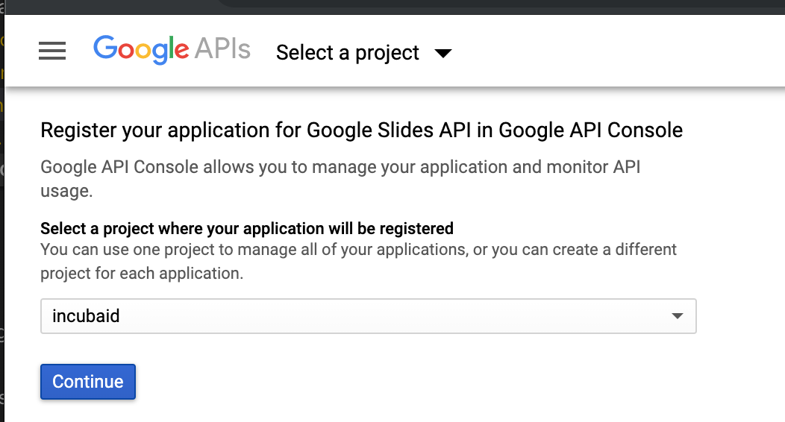
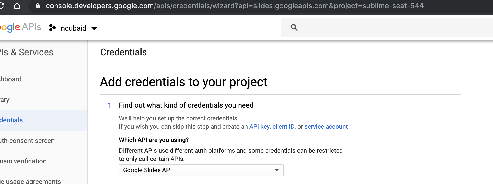
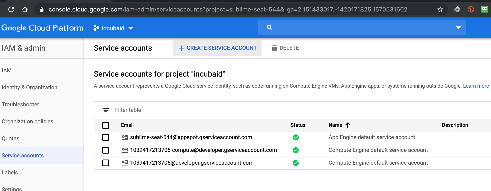
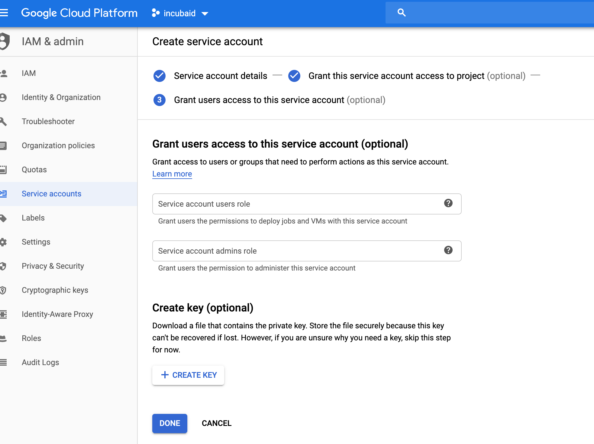
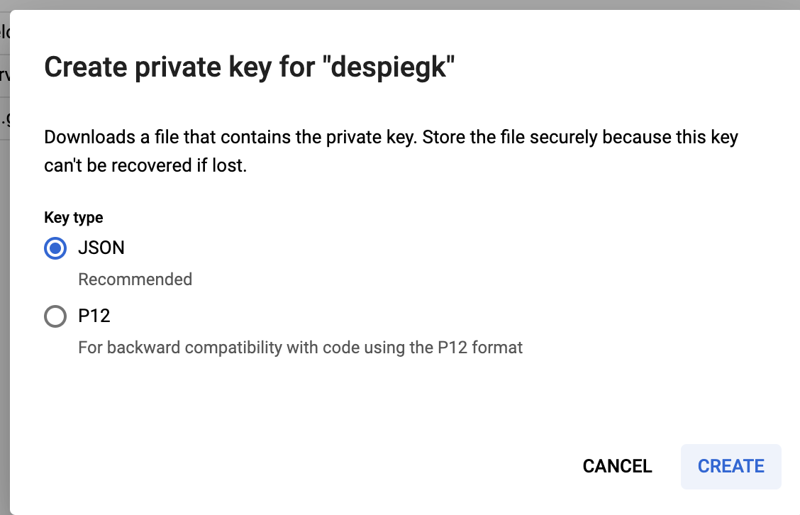

## Service account
Follow the following steps at [google console](console.developers.google.com/flows/enableapi?apiid=gdrive.googleapis.com):

- Create project
- Create credentials (type service account)
You need to enable and download credentials files using  or go to [Python Quickstart](https://developers.google.com/slides/quickstart/python) and choose enable slides API then download configurations.
- Download credentials (as json and save it anywhere on your filesystem)

click on link to service account (not easy to see), then copy this file to `/sandbox/var/cred.json`

## Screenshots describing how to get credentials for slides api

Using [Google console](https://console.developers.google.com/flows/enableapi?apiid=slides.googleapis.com)

choose broad enough rights e.g. owner

create key

select json

will be automatically downloaded, then copy it to `/sandbox/var/cred.json`

